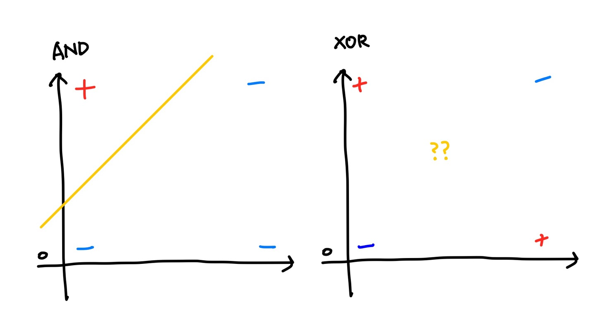

Deep learning

# Deep learning


#### 01. Deep Learning

ANN (Artificial Neural Network) 뉴런동작방식을 Logistic과 같이 프로그램화 하여 인공신경망을 만든 Perceptron이 존재했다.

Perceptron은 step function을 통해 0과1만이 결과로 나왔기 때문에 확률값이 나오는 Logistic을 많이 썼다.

사람들은 이 preceptron을 사용해서 AND, OR, NOR, XOR등의 CPU를 구현해보려 하였고, 구현된 Gate를 모아서 사고하는 perceptron을 만들고자 하였다.

결과적으로 AND, OR연산은 가능했지만, XOR 연산에 대해서는 불가능했다. 아래 그래프를 보면 하나의 Logistic 연산으로는 구분선을 그리기 어렵다는것을 볼 수 있다.




**Gate연산 Logistic Regression**

```python
# Logistic Regression으로 Gate연산을 구현
import numpy as np
import tensorflow as tf
from sklearn.metrics import classification_report

# Training Data Set
x_data = np.array([[0,0],
                   [0,1],
                   [1,0],
                   [1,1]], dtype=np.float64)

# AND GATE 연산에 대한 t_data
# t_data = np.array([0,0,0,1], dtype=np.float64)
# OR GATE 연산에 대한 t_data
# t_data = np.array([0,1,1,1], dtype=np.float64)
# XOR 연산에 대한 t_data
t_data = np.array([0,1,1,0], dtype=np.float64)

# place holder
X = tf.placeholder(shape=[None,2], dtype=tf.float32)
T = tf.placeholder(shape=[None,1], dtype=tf.float32)

# Weight & bias
W = tf.Variable(tf.random.normal([2,1]))
b = tf.Variable(tf.random.normal([1]))

# Hypothesis
logit = tf.matmul(X,W)+b
H = tf.sigmoid(logit)

# loss function
loss = tf.reduce_mean(tf.nn.sigmoid_cross_entropy_with_logits(logits=logit,
                                                              labels=T))
# Train
train = tf.train.GradientDescentOptimizer(learning_rate=1e-2).minimize(loss)

# Session, 초기화
sess = tf.Session()
sess.run(tf.global_variables_initializer())

# 반복학습
for step in range(30000):
    _, loss_val = sess.run([train, loss],
                           feed_dict={X:x_data,
                                      T:t_data.reshape(-1,1)})
    if step % 3000 == 0:
        print(f'loss_val: {loss_val}')

```

```python
# evaluation (모델평가)
predict = tf.cast(H >= 0.5, dtype=tf.float32)
predict_val = sess.run(predict, feed_dict={X:x_data})
print(predict_val)

# print(classification_report(정답(1차원), 예측(1차원)))
print(classification_report(t_data, predict_val.ravel()))
```

**Gate연산 Logistic Regression Layer 추가**

```python
# Logistic Regression으로 Gate연산을 구현
import numpy as np
import tensorflow as tf
from sklearn.metrics import classification_report

# Training Data Set
x_data = np.array([[0,0],
                   [0,1],
                   [1,0],
                   [1,1]], dtype=np.float64)

# XOR 연산에 대한 t_data
t_data = np.array([0,1,1,0], dtype=np.float64)

# place holder
X = tf.placeholder(shape=[None,2], dtype=tf.float32)
T = tf.placeholder(shape=[None,1], dtype=tf.float32)

# Weight & bias
W2 = tf.Variable(tf.random.normal([2,10]))
b2 = tf.Variable(tf.random.normal([10]))
layer2 = tf.sigmoid(tf.matmul(X,W2) + b2)

W3 = tf.Variable(tf.random.normal([10,6]))
b3 = tf.Variable(tf.random.normal([6]))
layer3 = tf.sigmoid(tf.matmul(layer2,W3) + b3)

W4 = tf.Variable(tf.random.normal([6,1]))
b4 = tf.Variable(tf.random.normal([1]))

# Hypothesis
logit = tf.matmul(layer3,W4)+b4
H = tf.sigmoid(logit)

# loss function
loss = tf.reduce_mean(tf.nn.sigmoid_cross_entropy_with_logits(logits=logit,
                                                              labels=T))
# Train
train = tf.train.GradientDescentOptimizer(learning_rate=1e-2).minimize(loss)

# Session, 초기화
sess = tf.Session()
sess.run(tf.global_variables_initializer())

# 반복학습
for step in range(30000):
    _, loss_val = sess.run([train, loss],
                           feed_dict={X:x_data,
                                      T:t_data.reshape(-1,1)})
    if step % 3000 == 0:
        print(f'loss_val: {loss_val}')

```

```python
# evaluation (모델평가)
predict = tf.cast(H >= 0.5, dtype=tf.float32)
predict_val = sess.run(predict, feed_dict={X:x_data})
print(predict_val)

# print(classification_report(정답(1차원), 예측(1차원)))
print(classification_report(t_data, predict_val.ravel()))
```

**Gate연산 Logistic Regression Layer 추가 ver.TF2**

```python
import numpy as np
import tensorflow as tf
from tensorflow.keras.models import Sequential
from tensorflow.keras.layers import Flatten, Dense
from tensorflow.keras.optimizers import SGD
from sklearn.metrics import classification_report

# Training Data Set
x_data = np.array([[0,0],
                   [0,1],
                   [1,0],
                   [1,1]], dtype=np.float64)

# XOR 연산에 대한 t_data
t_data = np.array([0,1,1,0], dtype=np.float64)

# Tensorflow 구현
model = Sequential()

model.add(Flatten(input_shape=(2,)))   # input layer
model.add(Dense(units=128,
                activation='sigmoid')) # 1번째 hidden layer
model.add(Dense(units=32,
                activation='sigmoid')) # 2번째 hidden layer
model.add(Dense(units=16,
                activation='sigmoid')) # 2번째 hidden layer
model.add(Dense(units=1,
                activation='sigmoid')) # output layer

model.compile(optimizer=SGD(learning_rate=1e-4),
              loss='binary_crossentropy')

model.fit(x_data,
          t_data.reshape(-1,1),
          epochs=30000,
          verbose=0)


```

```python
# evaluation(모델평가)
predict_val = model.predict(x_data)
predict_val = (tf.cast(predict_val > 0.5, dtype=tf.float32)).numpy().ravel()
print(predict_val)

print(classification_report(t_data, predict_val))
```


