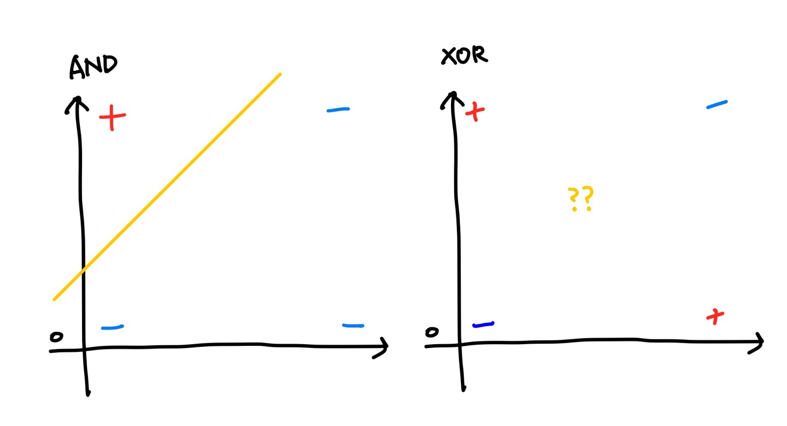

Deep learning

# Deep learning : DNN


### 01. DL : DNN

ANN (Artificial Neural Network) 뉴런동작방식을 Logistic과 같이 프로그램화 하여 인공신경망을 만든 Perceptron이 존재했다.

Perceptron은 step function을 통해 0과1만이 결과로 나왔기 때문에 확률값이 나오는 Logistic을 많이 썼다.

사람들은 이 preceptron을 사용해서 AND, OR, NOR, XOR등의 CPU를 구현해보려 하였고, 구현된 Gate를 모아서 사고하는 perceptron을 만들고자 하였다. 이렇게 단일 퍼셉트론으로 구성된 패턴분류장치를 <span style="background-color:#fff5b1;">SLP(Single Layer Perceptron)</span>이라고 한다.

결과적으로 AND, OR연산은 가능했지만, XOR 연산에 대해서는 불가능했다. 아래 그래프를 보면 하나의 Logistic 연산으로는 구분선을 그리기 어렵다는것을 볼 수 있다.



이 문제를 ANN을 본딴 Deep Learning으로 해결할 수 있다.

ANN은 neuron들끼리 얽혀있는 구조를 가지고 있다. DeepLearning은 1개의 Logistic regression을 표현하는 node가 서로 연결되어있는 신경망 구조를 바탕으로 1개의 입력층, 1개 이상의 은닉층, 그리고 출력층을 가지고 있다. 이렇게 여러층의 perceptron으로 적어도 1개 이상의 은닉층을 보유하고 있고, 경사하강법을 사용하는 알고리즘을 <span style="background-color:#fff5b1;">MLP(Multi Layer Perceptron)</span>이라고 한다.

은닉 Layer는 많을수록 학습이 잘 된다. 하지만 보통 1~3개의 은닉 Layer를 사용한다. 그 이유는 은닉 Layer를 늘릴수록 accuracy가 증가하진 않기 때문이다. 은닉층이 증가할수록 시간이 오래걸리므로 1~3개가 적당하며, 보통 1개가 효율이 좋다고 한다. 

은닉층의 개수에 따라 Network가 깊어지는것을 deep Network 라고 하고 이를 Deep Learning이라고 한다.


- Deep Learning은 각 층을 거쳐갈 때마다 W, b 의 값이 필요하다.
- 앞에서 뒤로 흐르는 Sequential Model이다.
- FC Layer (Fully Connected Layer) : Dense

이렇게 ANN처럼 얽혀있는 Deep Learning을 <span style="background-color:#fff5b1;">DNN(Deep Neuron Network)</span>DNN(Deep Neuron Network)라고 한다. 은닉층을 추가하여 학습해서 잘 나오기는 했지만, <span style="color:red">아직 해결해야 할 점이 있다.</span>

MLP는 역전파알고리즘(Backpropagation)으로 학습하며 경사하강법으로 에러를 최소화한다. 이 과정에서 트레이닝셋에 너무 과최적화 되어 Overfitting이 발생하고 경사하강법 미분이 여러레이어에 거쳐 반복되며 Vanishing Gradient가 발생한다.

### 02. DL : DNN 보완

MLP가 여러가지 문제로 빛을 보지 못하고 있는동안 RegressionV, SVM, Decision Tree, KNN, Naive Bayes 등의 Machine Learning이 생겨났다.  그리고 2006년에 Xiviel 초기화법, He's초기화법, Relu를 사용한 Deep Learning이 등장하였다.

1. 초기화

   기존 w, b의 값의 초기값으로 0또는 랜덤값을 임의로 사용하는 방법에서 새로운 initializer를 사용한다.

   - Xievier Initializer, He's Initializer

2. Vanishing Gradient 현상 해결

   Back Propagation (역전파 알고리즘)으로 역의 방향으로 w,b를 update하면서 뒷쪽값은 조절이 잘 되지만 앞쪽의 값은 잘 조절이 되지 않는 Vanishing Gradient 문제

   Activation함수를 sigmoid 대신 Relu를 사용

3. DropOut

   연산에 사용되는 node를 줄여 학습시간이 오래걸리는문제, overfitting 을 해결한다.

4. Early Stopping

   epoch은 hyperparameter로 너무작으면 underfitting을, 너무 크면 overfitting을 초래할 수 있다.

   loss는 일반적으로 epoch이 진행될수록 작아진다. 하지만 어느정도 epoch이 진행되면 loss값의 감소가 줄어든다. Early Stopping은 더이상 학습의 의미가 없을 때, 멈춰주는 역할을 한다.


### Ref

[Deep Learning(ANN, DNN, CNN, RNN, SLP, MLP) 비교](https://dbrang.tistory.com/1537)


### Code

##### 01. DL:DNN

**SLP : Gate연산 Logistic Regression**

```python
# Logistic Regression으로 Gate연산을 구현
import numpy as np
import tensorflow as tf
from sklearn.metrics import classification_report

# Training Data Set
x_data = np.array([[0,0],
                   [0,1],
                   [1,0],
                   [1,1]], dtype=np.float64)

# AND GATE 연산에 대한 t_data
# t_data = np.array([0,0,0,1], dtype=np.float64)
# OR GATE 연산에 대한 t_data
# t_data = np.array([0,1,1,1], dtype=np.float64)
# XOR 연산에 대한 t_data
t_data = np.array([0,1,1,0], dtype=np.float64)

# place holder
X = tf.placeholder(shape=[None,2], dtype=tf.float32)
T = tf.placeholder(shape=[None,1], dtype=tf.float32)

# Weight & bias
W = tf.Variable(tf.random.normal([2,1]))
b = tf.Variable(tf.random.normal([1]))

# Hypothesis
logit = tf.matmul(X,W)+b
H = tf.sigmoid(logit)

# loss function
loss = tf.reduce_mean(tf.nn.sigmoid_cross_entropy_with_logits(logits=logit,
                                                              labels=T))
# Train
train = tf.train.GradientDescentOptimizer(learning_rate=1e-2).minimize(loss)

# Session, 초기화
sess = tf.Session()
sess.run(tf.global_variables_initializer())

# 반복학습
for step in range(30000):
    _, loss_val = sess.run([train, loss],
                           feed_dict={X:x_data,
                                      T:t_data.reshape(-1,1)})
    if step % 3000 == 0:
        print(f'loss_val: {loss_val}')
        
### evaluation (모델평가) ###
predict = tf.cast(H >= 0.5, dtype=tf.float32)
predict_val = sess.run(predict, feed_dict={X:x_data})
print(predict_val)

# print(classification_report(정답(1차원), 예측(1차원)))
print(classification_report(t_data, predict_val.ravel()))
```

**MLP : Gate연산 Logistic Regression Layer 추가**

```python
# Logistic Regression으로 Gate연산을 구현
import numpy as np
import tensorflow as tf
from sklearn.metrics import classification_report

# Training Data Set
x_data = np.array([[0,0],
                   [0,1],
                   [1,0],
                   [1,1]], dtype=np.float64)

# XOR 연산에 대한 t_data
t_data = np.array([0,1,1,0], dtype=np.float64)

# place holder
X = tf.placeholder(shape=[None,2], dtype=tf.float32)
T = tf.placeholder(shape=[None,1], dtype=tf.float32)

# Weight & bias
W2 = tf.Variable(tf.random.normal([2,10]))
b2 = tf.Variable(tf.random.normal([10]))
layer2 = tf.sigmoid(tf.matmul(X,W2) + b2)

W3 = tf.Variable(tf.random.normal([10,6]))
b3 = tf.Variable(tf.random.normal([6]))
layer3 = tf.sigmoid(tf.matmul(layer2,W3) + b3)

W4 = tf.Variable(tf.random.normal([6,1]))
b4 = tf.Variable(tf.random.normal([1]))

# Hypothesis
logit = tf.matmul(layer3,W4)+b4
H = tf.sigmoid(logit)

# loss function
loss = tf.reduce_mean(tf.nn.sigmoid_cross_entropy_with_logits(logits=logit,
                                                              labels=T))
# Train
train = tf.train.GradientDescentOptimizer(learning_rate=1e-2).minimize(loss)

# Session, 초기화
sess = tf.Session()
sess.run(tf.global_variables_initializer())

# 반복학습
for step in range(30000):
    _, loss_val = sess.run([train, loss],
                           feed_dict={X:x_data,
                                      T:t_data.reshape(-1,1)})
    if step % 3000 == 0:
        print(f'loss_val: {loss_val}')
        
### evaluation (모델평가) ###
predict = tf.cast(H >= 0.5, dtype=tf.float32)
predict_val = sess.run(predict, feed_dict={X:x_data})
print(predict_val)

# print(classification_report(정답(1차원), 예측(1차원)))
print(classification_report(t_data, predict_val.ravel()))
```

**MLP : Gate연산 Logistic Regression Layer 추가 ver.TF2**

```python
import numpy as np
import tensorflow as tf
from tensorflow.keras.models import Sequential
from tensorflow.keras.layers import Flatten, Dense
from tensorflow.keras.optimizers import SGD
from sklearn.metrics import classification_report

# Training Data Set
x_data = np.array([[0,0],
                   [0,1],
                   [1,0],
                   [1,1]], dtype=np.float64)

# XOR 연산에 대한 t_data
t_data = np.array([0,1,1,0], dtype=np.float64)

# Tensorflow 구현
model = Sequential()

model.add(Flatten(input_shape=(2,)))   # input layer
model.add(Dense(units=128,
                activation='sigmoid')) # 1번째 hidden layer
model.add(Dense(units=32,
                activation='sigmoid')) # 2번째 hidden layer
model.add(Dense(units=16,
                activation='sigmoid')) # 2번째 hidden layer
model.add(Dense(units=1,
                activation='sigmoid')) # output layer

model.compile(optimizer=SGD(learning_rate=1e-4),
              loss='binary_crossentropy')

model.fit(x_data,
          t_data.reshape(-1,1),
          epochs=30000,
          verbose=0)


### evaluation(모델평가)###
predict_val = model.predict(x_data)
predict_val = (tf.cast(predict_val > 0.5, dtype=tf.float32)).numpy().ravel()
print(predict_val)

print(classification_report(t_data, predict_val))

```

##### 02. DL:DNN보완


#### 


