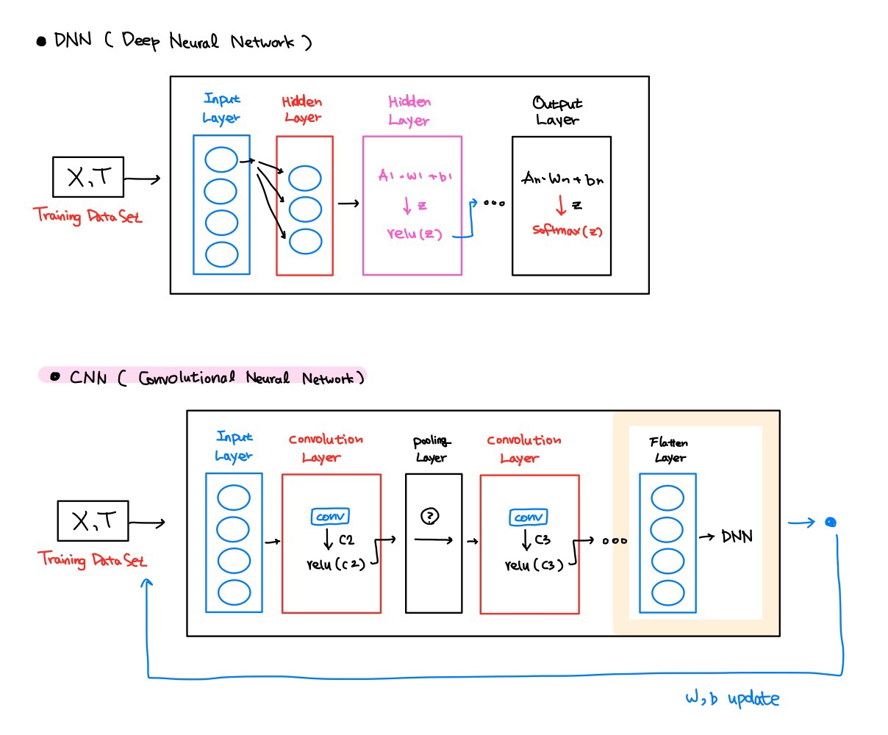
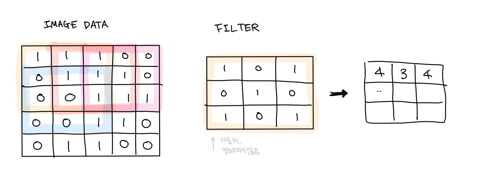
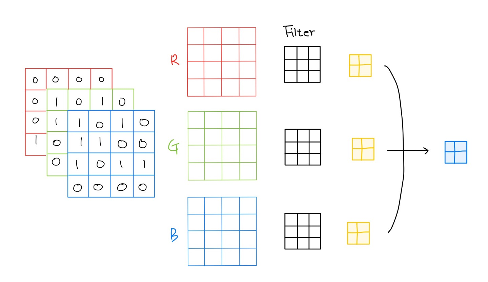

Deep learning

# Deep learning : CNN

#### CNN(Convolution Neural Network)

- "computer vision" : computer가 이미지를 보고 사람혹은 여러 객체를 식별하고 파악할 수 있도록 지원하는 computer science 분야
- Deep Learning
  - vision : 대표적인 알고리즘 (CNN)
  - NLP(Natural Language Process) (RNN, LSTM)
- computer vision의 목적 : pixel을 이해하는 방법을 고안한다.

#### 이미지 좌표계

이미지 좌표는 우리가 원래알던 2차원 그래프의 좌표와 다르게 사용한다.

좌측 위부터 (0,0)으로, ndarray로 표현하면 pixel[세로.가로] 로 사용한다.

#### Digital Image의 형태

1. 이진이미지 (binary image) 

   가장 간단한 형태로 각 pixel의 값이 0(어두움) or 1(밝음)으로 표현된다.

   > 각 pixel당 1bit단위이지만 실제 구현시에는 8bit로 표현해서 size가 작아지지는않음

2. 흑백이미지 (gray-scaled image)

   각 pixel의 값을 0~255 사이의 값(8bit) 으로 표현한 이미지

   Deep learning 시 colored image를 gray-colored image로 변환해서 사용하기도 한다.

3. 컬러이미지 (color image)

   각 pixel의 값을 R(0~255), G(0,255), B(255) 총 24bit로 표현하며 True Color라고 한다.

#### CNN (Convolutional Neural Network)

CNN은 convnet(합성곱 신경망)이라고도 불린다.

이전에는(MNIST) Image의 pixel그 자체를 DNN을 사용하여 학습하였다면,
CNN은 Image의 특징을 추출한(Feature extraction) pixel을 DNN을 이용해서 학습한다.

그래서 만약 이미지 1장이 3차원이라면 이미지 여러장을 학습할 경우 4차원이라는 것이다.

convolution layer에서는 convolution(합성곱) 연산을 하게된다.

합성곱 연산은 두 함수 f,g가 있을 때 하나의 함수를 반전(reverse), 전이(shift) 시켜서 두 함수를 곱한 후 적분하는 연산이다.

아래 그림을 보면 Image Data와 Filter가 있다. 

Filter는 이미지 특징을 추출하기 위한 공용 parameter이다.

> 일반적으로 정사각형구조, (3x3) (4x4)의 형태가 효과적이라고 한다.
>
> filter도 channel을 가지고 있고 이 channel의 값은 들어온 image의 channel과 같아야 한다.

Image Data에서 Filter를 얹어 각 위치의 값을 곱한 값을 더하여 이미지의 특징을 추출해 낸 것을 Feature map (Activation map) 이라고 한다.

그림에서는 stride가 1로, Filter가 한칸씩 움직이게 설계되었다.

> stride는 이미지의 크기에 따라서 제약을 받는다. 일반적으로 1을 많이 사용한다.

Filter는 여러개를 사용하여 이미지의 특징을 다양하게 추출할 수 있다.

Feature Map은 필터 하나당 하나가 나오기 때문에 이렇게 표현할 수 있다.

각 channel 당 convolution결과가 하나의 결과로 나오게된다.

Filter와 stride를 지나면서 Feature Map의 크기는 작아진다.

이전 이미지의 지속적인 작아짐을 방지하는 방법중 Padding 이 있다.

Filter를 여러개 사용하기 때문에 실제 데이터양은 상당히 많이 증가하게 된다.

이 문제를 해결하기 위해 Pooling을 사용해서 특징을 부각하면서 데이터를 줄인다.

> MAX, AVERAGE, MIN 기법 등이 있지만, CNN에서는 MAX 기법을 선호한다.
>
> 큰값의 특징을 잘 대변하고 있기 때문에 이미지 유실 걱정은 하지 않아도 된다.

