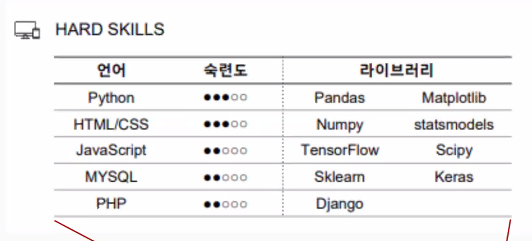
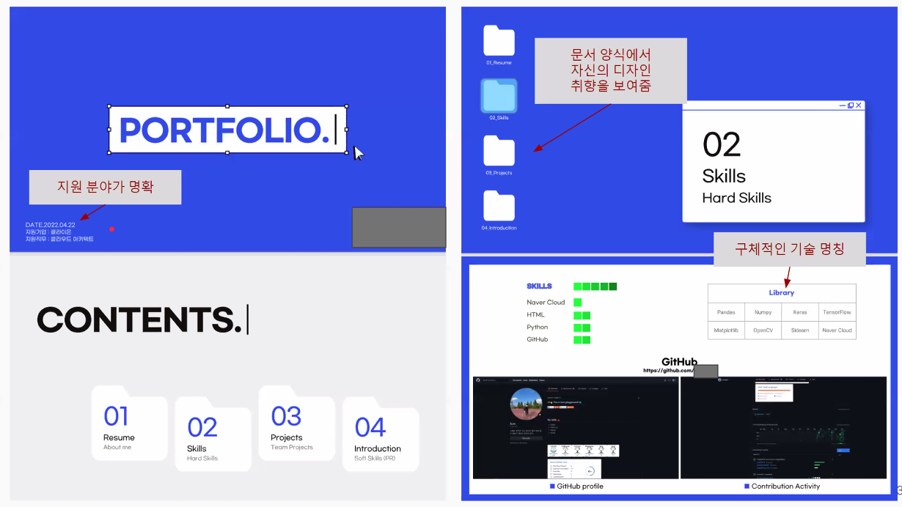
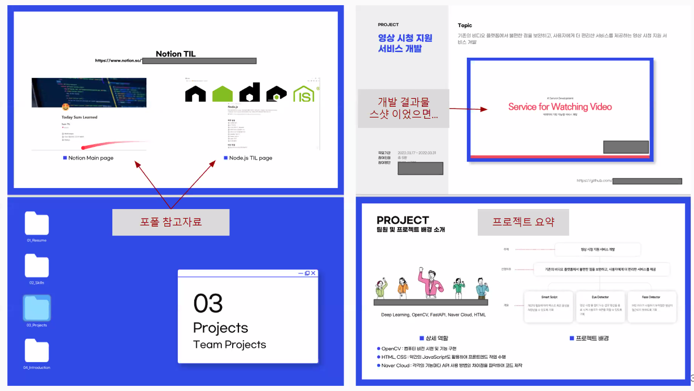
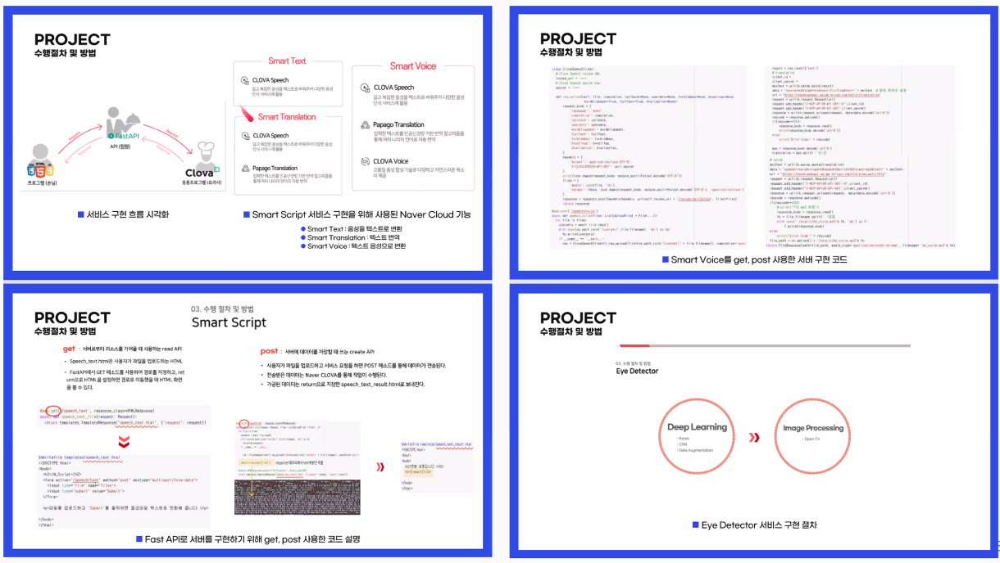
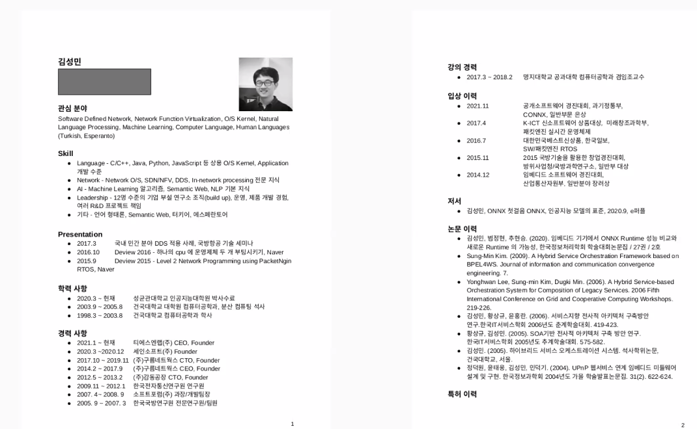
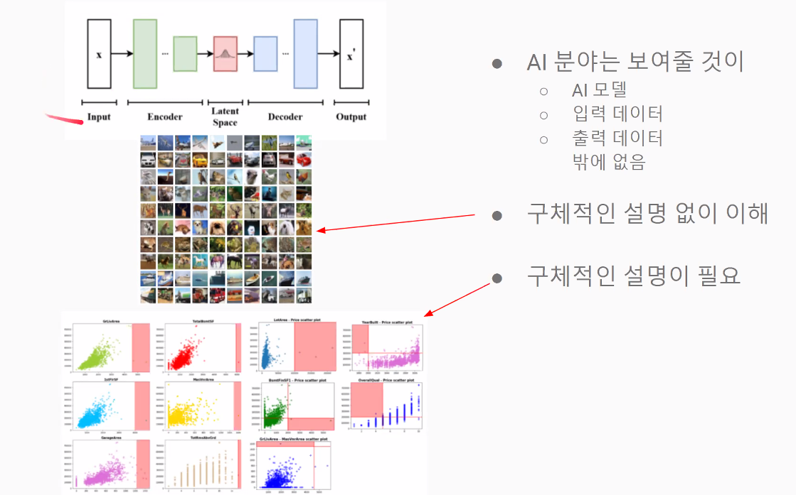
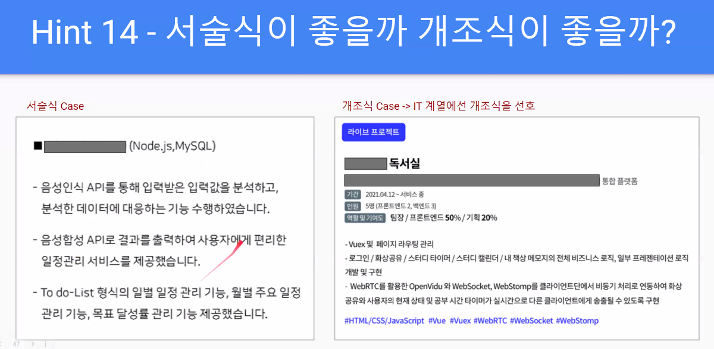

pdf
notion - 제출못하는 형식
linked in

---

언어 : 사용한 기술을 자세하게, Framework, library 등
OS : Windows
DB
개발기간
기획 의도,대상
달성한 부분
개발 단계 : 기획 흐트러진다. Waterfall model? "애자일 이 뭘까?"
        비현실적이지 않게
        개발방법론 
결과물 : 나의역할을 써주자

---

포트폴리오에 쓴 내용을 중심으로 면접관이 상세한 질문을 던질것이다.
포트폴리오를 과장해서는 안된다.

---

대략적으로 잘보인다 / 어떤알고리즘을 사용했는지 보인다.
실현불가 개발단계 / AI모델에 대한 내용 부족

언어  숙련도  라이브러리

- git 커밋갯수, 스타개수..... 중요

- library에 대한 질의응답 중요

---

기술적으로 굉장히 뒤떨어져있는것은 하지않는것이 좋음

Node js, React 등등

코드 : 흰바탕에 검은글씨가 나아요

---

예쁘게 만들기보다 가독성있게 만드는것이 중요하다.

---

---

AI가 보여줄 수 있는거

---

개인정보는 그곳에 갈거라면 다 써넣어라

이름, 주민번호, 개인번호, 이메일, 주소 등

---

IT는 읽기쉽도록 간단하게

---

나이 상관없음

회사가 원하는 방향으로 갈 수 있는 인재를 원한다.

