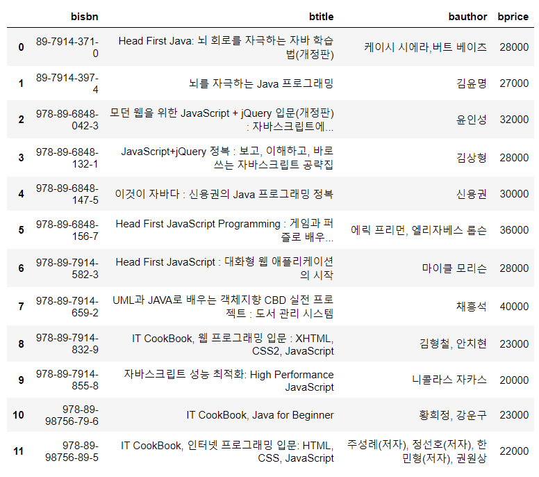

Machine learning

# Pandas Data Import

여러가지 외부 resource를 사용해서 DataFrame을 생성

1. CSV 파일을 이용해서 DataFrame을 생성

2. MySQL 안에 Database로부터 SQL을 이용해 DataFrame을 생성

   - 프로그램적으로 SQL을 직접 이용

   - ORM방식을 이용해서 사용(Django)

3. SQL을 JSON형태로 저장

4. JSON으로 DataFrame 생성

5. Open API를 이용해서 DataFrame을 생성


### 01. csv import

```python
import numpy as np
import pandas as pd

df = pd.read_csv('./data/student.csv')

display(df)
```


### 02. SQL import

#### A. Imstall pymysql

외부프로그램적으로 SQL을 직접 이용한다.

Anaconda Prompt에서 사용할 환경으로 이동한 다음 pymysql을 설치해준다.

```powershell
> conda install pymysql
```

#### B. Workbench Data import

MySQL 안에 데이터베이스 생성하고 제공된 Script를 이용해서 Table을 생성

```sql
Create DATABASE lecture_0317;

USE lecture_0317;
```

File > Open SQL Script > sql 파일 오픈

테이블에서 우클릭 > Select Rows 를 사용해서 입력된 데이터를 볼 수 있음

#### C. jupyter notebook에서 sql import

```python
import pymysql
import numpy as np
import pandas as pd

con = pymysql.connect(host='localhost',
                     user='root',
                     password='test1234',
                     db='lecture_0317',
                     charset='utf8')
print(con)

# <pymysql.connections.Connection object at 0x0000023E9B6FC190>
```

pymysql을 사용해서 Database 연결을 시도해 보고, 성공하면 연결객체를 얻는다.

sql에서 사용할 sql문을 python에서 작성해서 pandas로 받아올 것이다.

```python
sql = "SELECT bisbn, btitle, bauthor, bprice FROM book WHERE btitle LIKE '%java%'"

df = pd.read_sql(sql, con)
display(df)
```



만들어진 연결에 대해서 sql문을 실행하고, dataframe으로 만든다.

#### D. sql data를 json file로 저장하기

```python
with open('./data/json/books.json', 'w', encoding='utf-8') as file:
    df.to_json(file, force_ascii=False)
```

생성된 json 파일은 한줄로 이루어져 있다. 

google > json formatter 를 검색해서 json을 보기좋게 바꿀 수 있다.

#### E. Json을 DataFrame으로 변경하기

```python
# JSON을 읽어들여 DataFrame을 생성
import numpy as np
import pandas as pd
import json  			# 내장 module

with open('./data/json/books.json', 'r', encoding='utf-8') as file:
    dict_books = json.load(file)
    
df = pd.DataFrame.from_dict(dict_books)
```

json 내장모듈을 사용하여 file을 load하면 python에서 dictionary로 읽어들일 수 있다.

읽어들인 dictionary file을 `from_dict`를 사용해서 DataFrame으로 바꿔주면 된다.

### 03. OpenAPI를 사용해 DataFrame 생성

영화진흥위원회 OPEN API

```python
# OPEN API 를 이용해서 DataFrame을 생성
import numpy as np
import pandas as pd
import urllib       # open api 호출하기 위해서 필요한 module
import json

# 영화진흥위원회 OPEN API 호출에 대한 URL을 Query String을 이용해서 작성
url = 'http://www.kobis.or.kr/kobisopenapi/webservice/rest/boxoffice/searchDailyBoxOfficeList.json'
Query_String = '?key={key value}'
movie_url = url + Query_String

load_page = urllib.request.urlopen(movie_url)
print(load_page)
# <http.client.HTTPResponse object at 0x0000023E9DDDB310>

my_dict = json.loads(load_page.read())
print(my_dict)
```

oepn api를 호출해주기 위해 필요한 module을 선언해주고, json 모듈을 선언해준다.

open api는 영화진흥위원회의 일별박스오피스 request url을 사용하였다.

영화진흥위원회에 로그인하여 key value를 얻어와서 요청 url을 만들어주었다.

만들어진 movie_url 과 urllib를 사용해 request를 보낸 json 결과를 받는다.

이제 json 모듈을 사용해서 dictionary로 만들어주고, DataFrame으로 변경해주어야 한다.

👀 read() 는 byte 단위로 받아오는 거리서 loads를 사용해야 한다.

open api로 받은 데이터는 DataFrame으로 바로 만들어질 수 없기 때문에 이제 여기부터는 로직을 작성하여 DataFrame으로 변경해주어야 한다.

#### Box office Data 예제

json 핸들링해서 Box office data 2차원으로 예쁘게 만들기


### 04. Excel Import

excel import를 위한 도구 설치

```python
> conda install openpyxl
```

```python
df = pd.read_excel('./data/lineplot_sample_data.xlsx')
```


### 05. encoding type

```powershell
> pip install chardet
```

promp 창에서 모듈 설치

```python
import chardet
with open('./data/weather/seoul.csv','rb') as f: file_data = f.readline()
enc = chardet.detect(file_data)['encoding']
```
```python
df_seoul = pd.read_csv('./data/weather/seoul.csv', encoding=enc)
```

한줄을 읽고 그 파일에 대한 encoding정보를 가져와서 read_csv에 인자로 준다.

- ERROR : Error tokenizing data. C error: Expected 1 fields in line 8, saw 5

  ```python
  df_seoul = pd.read_csv('./data/weather/seoul.csv', encoding=enc, sep='\t')
  ```

  파일포맷의 띄어쓰기가 '\t'를 구분자(delimiter)로 설정되어있어 읽어올때 적당한 파라미터를 설정
