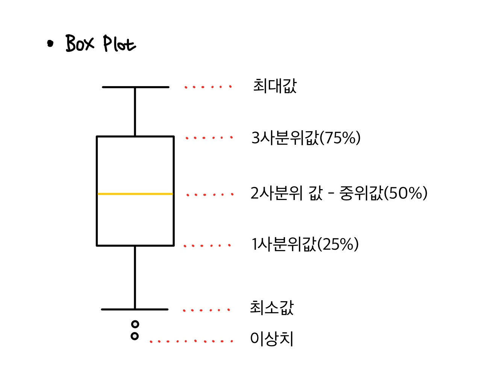

Machine learning

# Pandas Matplotlib


그래프

1. Line plot
2. Histogram
3. Scatter(산점도)
4. Boxplot

- subplot
- 한글설정


---


#### 01. Matplotlib 초기설정

matplotlib을 사용할 때, 한글이 제대로 설정되지 않아 깨지는 현상이 발생한다.

'Malgun Gothic' font를 다운받아 font 파일에 저장해주고, 이를 적용해줄것이다.

그 외 다른 warning이 뜨지않게 하는 설정등을 추가해주었다.

```python
import matplotlib as mpl
import matplotlib.pyplot as plt
import matplotlib.font_manager as fm
from matplotlib import rc

import warnings
import numpy as np
import pandas as pd

# warning 출력 ignore
warnings.filterwarnings(action='ignore')

# 그래프에서 '-' 기호 때문에 문제 발생하는것 방지
mpl.rcParams['axes.unicode_minus'] = False

# 한글폰트 적용
font_path = './font/malgun.ttf'
font_name = fm.FontProperties(fname=font_path).get_name()
rc('font', family=font_name)
```


#### 02. Lineplot

figure를 선언해서 figsize를 변경해 주었다.

```python
# lineplot
plt.style.use('ggplot')
plt.figure(figsize=(10,5))      # 그래프 크기 설정
plt.xticks(rotation='vertical') # x축 숫자 세로로 출력되게 설정

plt.plot(s.index, s.values,
         marker='o',            # o는 circle marker, 's'는 square marker 등
         markersize=8,          # marker 크기
         markerfacecolor='r',
         color='g',
         linewidth=2)

plt.title('서울에서 경기도로 전입한 사람 추이')
plt.xlabel('연도')
plt.ylabel('이동 인구수')

plt.legend(labels=['서울->경기'], loc='best')
plt.show()
```


#### 03. subplot()

그래프를 여러개 그리려면 subplot()을 사용한다.

Figure는 canvas를 나타내는 객체로 쉽게말해 도화지라고 할 수 있다.

> 📌 Figure 객체
>
> jupyter notebook은 plot() 을 사용하면 자동으로 Figure 객체를 만들어줘요
>
> 만약 canvas(도화지)의 크기를 임의로 설정하려면 Figure 객체를 만들어야 해요

> 📌 Matplotlib
>
> Figure, Axes, Axis의 차이를 숙지해야한다. [참고 링크](https://velog.io/@ljs7463/matplotlib-%EC%98%A4%EB%A5%B8%EC%AA%BD-Y%EC%B6%95-%EC%82%AC%EC%9A%A9%ED%95%98%EB%8A%94%EC%9D%B4%EC%9C%A0%EC%99%80-%EB%B0%A9%EB%B2%95)

Figure 객체는 1개이상의 Axes로 구성된다.  (plot() 함수를 사용하면 자동으로 Axes도 하나 생성)

```python
# subplot
plt.style.use('ggplot')

fig = plt.figure(figsize=(20,8))
ax1 = fig.add_subplot(1,2,1)
ax2 = fig.add_subplot(1,2,2)

ax1.set_title('서울에서 경기도로 전입한 사람 추이')
ax1.set_xlabel('연도')
ax1.set_ylabel('이동 인구수')

ax1.plot(s.index, s.values)

ax2.plot(s.index, s.values,
        marker='o',    # o는 circle marker, 's'는 square marker 등
         markersize=8,   # marker 크기
         markerfacecolor='r',
         color='g',
         linewidth=2)
plt.show()
```


#### 04. histogram

변수가 하나인 단변수 데이터의 빈도수를 그래프로 표현한 것이다.

x축을 같은 크기의 여러구간(bin)으로 나누고 
y축은 해당 구간안에 포함된 데이터의 개수 (빈도, mode)를 표현한다.

```python
# histogram 

df = pd.read_csv('./data/auto-mpg.csv', header=None)
df.columns = ['mpg', 'cylinders', 'displacement', 'horsepower',
              'weight','acceleration','year','origin','name']

df['mpg'].plot(kind='hist',
              bins=10)
```

#### 05. scatter

scatter은 산점도라고도 하며, 두개 변수간의 상관관계를 볼때 사용한다.

2개의 변수의 값을 각각 x축과 y에 하나씩 놓고 데이터 값이 위치하는 (x,y) 좌표를 찾아서 점을 표현한다.

```python
df = pd.read_csv('./data/auto-mpg.csv', header=None)
df.columns = ['mpg', 'cylinders', 'displacement', 'horsepower',
              'weight','acceleration','year','origin','name']

df.plot(kind='scatter',
        x = 'weight',
        y = 'mpg')
```

#### 06. boxplot

단변수의 분포를 살펴보기 위해서 사용한다.

```python
df = pd.read_csv('./data/auto-mpg.csv', header=None)
df.columns = ['mpg', 'cylinders', 'displacement', 'horsepower',
              'weight','acceleration','year','origin','name']

display(df.head(3))

# 제조국 별 연비분포 제조국(origin) -> 1:USA, 2:EU, 3: JPN
plt.boxplot(x=[df.loc[df['origin']==1,'mpg'],
               df.loc[df['origin']==2,'mpg'],
               df.loc[df['origin']==3,'mpg']])
plt.show()
```

- 중위값은 전체 데이터의 중간으로 이상치에 크게 영향을 받지 않는 특징이 있다.

  그래서 평균 대신 대표값으로 많이 사용된다.

- Boxplot에서 나오는 outlier는 수치적 계산으로 나온 이상치 일 뿐, 실제로 이상치인지는 모른다.




