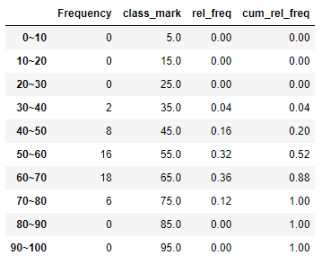
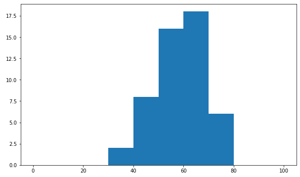
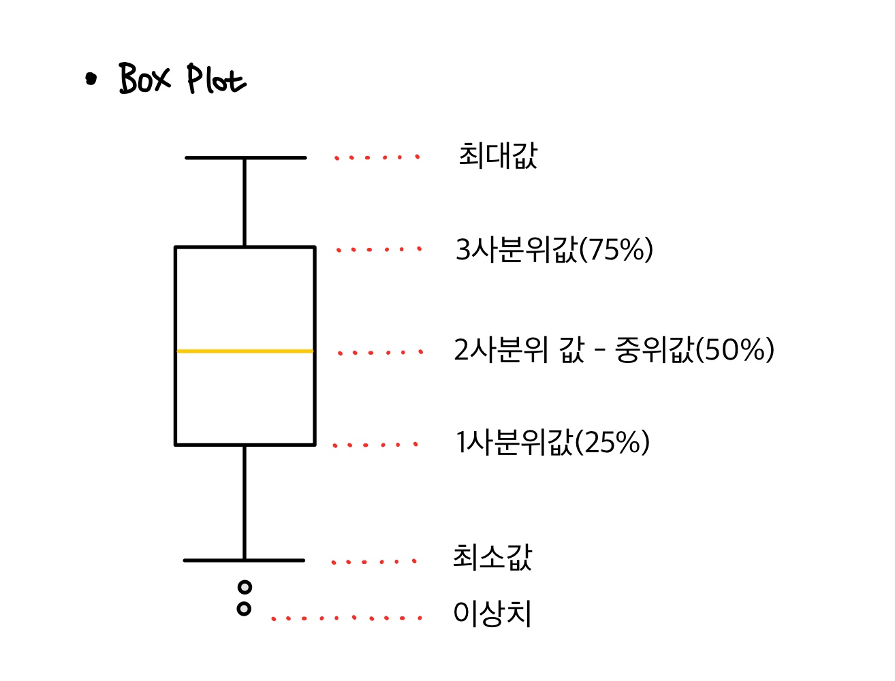
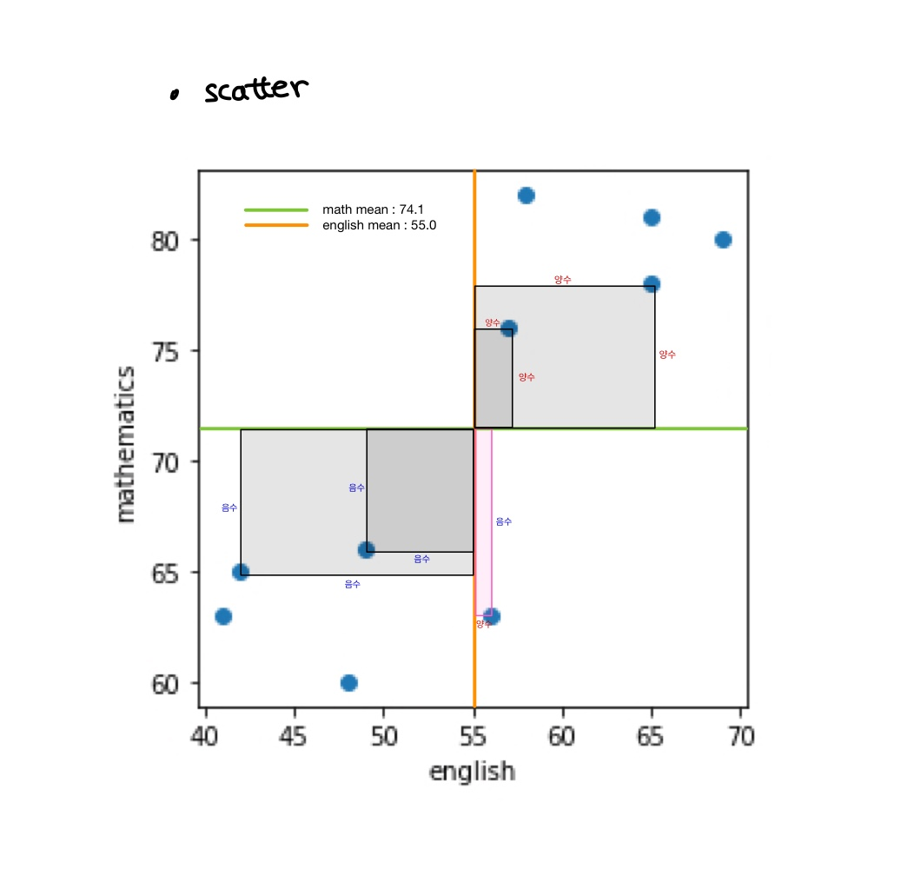

Machine learning

# 기술 통계


데이터의 성질 이해

### 01. Data

- 질적변수(Qualitative Variable) : 수치로 표현하기 보다는 범주로 구분하는 변수

  - 명목변수 : 단순히 분류를 목적으로 하는 변수

    예) 학번, 전화번호, 성별, 혈액형

  - 순위변수 : 순위, 대소 관계에 의미가 있는 변수

    예) 성적순위, 학점, 설문조사 만족도 항목

- 양적변수(Quantitative Variable) : 대상의 특성을 수치로 나타낼 수 있는 변수

  - 이산형 변수, 연속형 변수

    - 이산형 변수 : 두 숫자 사이에 다른값이 존재하지 않는 변수

      예) 정수, 주사위의 눈, 횟수, 사람 수 등

    - 연속형 변수 : 두 숫자 사이에 반드시 값이 포함되는 변수

      예) 실수, 신장, 체중, 거리 등

  - 간격 변수, 비율 변수

    - 간격변수 : 대소관계와 그 차이에도 의미를 두는 변수

      예) 연도

    - 비율변수 : 대소, 차이, 비례에 의미를 두는 변수

      예) kg(무게), cm(길이)

- 독립변수, 종속변수 : 각 변수의 관계

  - 독립변수(Independent Variable) : 다른 변수에 영향을 미치는 변수

  - 종속변수(Dependent Variable) : 다른 변수에 영향을 미치지 못하고 영향을 받는 변수

  - 수식

      $$
      y = a + bx
      $$
      x가 변화함에 따라 b 만큼의 영향을 받아 y가 변하게 되므로, 
      
      x는 독립변수, y는 종속변수라고 할 수 있다.

- 통제변수(Control Variable)

  - 기본적으로 독립변수와 비슷하나, 연구·조사의 주된 관심사가 되는 변수가 아닌 경우를 지칭

  > 📄 예시
  >
  > 고객만족과 재방문율을 연구할 때, 고객만족이 독립변수, 재방문율이 종속변수이다.
  >
  > 하지만 재방문율에 영향을 미치는 변수는 하나가 아닌 여러개일 것이기 때문에 다른 중요한 변수들을 감안해야한다.

  - 통제변수를 하나도 감안하지 않은 경우 Model Misspecification이 발생한다.
    Model Misspecification : 모델이 잘못되었다는것(매우 중요한 변수들이 빠졌다는 의미)


<details><summary>📌 <span style="background-color:#fff5b1;">측정 척도 더보기</span></summary>
  <table>
      <tr>
        <th colspan='2' style="text-align:center;">측정척도(Scale of Measurement)</th>
      </tr>
      <tr>
        <th style="text-align:center;">명목척도<br>(Normal scale)</th>
        <td >
            ● 가장 낮은 수준의 척도<br>
            ● 특정 대상의 특성을 명칭으로 구별하는 척도<br>
            ● 가감승제의 수학적 연산기능을 수행하지 못함<br>
            ● 같다, 다르다 관계만 성립<br>
         </td>  
      </tr>
      <tr>
        <th style="text-align:center;">서열척도<br>(Ordinal scale)</th>
        <td >
            ● 명목척도의 속성에 서열적인 의미가 부여됌<br>
            ● 크고 작은 순서, 많고 적은 순서의 관계 성립<br>
            ● 수학적 계산 불가능<br>
          </td>
      </tr>
      <tr>
        <th style="text-align:center;">간격척도<br>(Internal scale)<br>= 등간척도</th>
        <td>
            ● 측정 대상의 속성에 따라 순서를 정할 수 있을 뿐만 아니라 등급 간의 간격이 같은 변수<br>
            ● '0'의 개념이 없다.<br>
            ● 수학적 계산 불가능<br>
        </td>
      </tr>
      <tr>
        <th style="text-align:center;">비척도<br>(Ratio scale)<br>= 비율척도</th>
        <td>
            ● 측정 수준이 가장 높은 수준의 척도<br>
            ● 측정값의 순위과 간격, 절대적인 크기를 알 수 있다.<br>
            ● '0'의 개념을 포함함으로 가감승제가 가능하다.<br>
        </td>  
      </tr>
      <tr>
        <th style="text-align:center;">else</th>
        <td>
            ● 비척도는 명목척도나 서열척도로 변환 가능<br>
            ● 명목척도는 서열척도나 비척도로 전환 불가능<br>
            ● <a herf='http://contents.kocw.or.kr/KOCW/document/2014/wonkwang/leejeongmi/1.pdf'>reference</a><br>
        </td>
      </tr>
  </table>
  <br><br>
  &nbsp;&nbsp;🛠 변수들 간의 연관성 분석하기  <br>
  <table>
      <tr>
          <th colspan='2' rowspan='2'></th>
          <th colspan='2' style="text-align:center;">변수 1</th>
      </tr>
      <tr>
          <th style="text-align:center;">질적 변수(Category)</th>
          <th style="text-align:center;">양적 변수(Numeric)</th>  
      </tr>
      <tr>
          <th rowspan='2' width='80'>변수 2</th>
          <th style="text-align:center;">질적<br>변수</th>
          <td style="text-align:center;">Cross Table<br>Mosaic Plot</td>
          <td style="text-align:center;">Box Plot<br>범주(Category)별 통계 분석</td>  
      </tr>
      <tr>
          <th style="text-align:center;">양적<br>변수</th>
          <td style="text-align:center;">Box Plot<br>범주(Category)별 통계 분석</td>
          <td style="text-align:center;">Correlation<br>Regression<br>Scatter Plot</td>  
      </tr>
    </table>
</details>


### 02. 1차원(1변수) 데이터

#### A. 수치 지표

##### 1) 대표값

데이터를 하나의 값으로 요약한 지표이다.

###### a. 평균(mean)

평균은 대표값으로 자주 사용되지만, 이상치에 약하다는 단점이 있다.
$$
\bar{x} = {1\over n}\sum_{i=1}^n x_{i} = {1\over n}(x_{1}+x_{2}+ \cdot\cdot\cdot x_{n})
$$

> [1, 2, 3, 4, 5, 1000]  
>
> 평균은 위의 1000처럼 이상치에 민감하게 반응한다.

```python
scores = df['english'][:10]
scores_df = pd.DataFrame(scores)

print(scores.mean())  	# 55.0   Series의 메소드를 이용해서 구한거예요!
print(np.mean(scores)) 	# 55.0   Numpy의 mean()함수를 이용해서 구한거예요!
print(scores_df.mean()) # 55.0   DataFrame의 메소드를 이용해서 구할 수 있어요! 
                        #        단, 결과가 Series로 출력돼요!
```

###### b. 중위값(median)

> [1, 2, 3, **4**, 5, 10, 12]
>
> 가운데 있는 4가 중위값이다.
>
> [1, 2, **3**, **4**, 5, 6]
>
> 전체의 길이가 짝수개일경우, 중간 두개의 값의 평균으로 중위값을 계산한다.

```python
print(scores.median())		# 56.5
print(np.median(scores))  	# 56.5
print(scores_df.median())	# 56.5
```

###### c. 최빈값(mode)

> [1, 1, 1, 1, 2, 2, 3]
>
> 가장 많은 1이 최빈값이다.
>
> 📌 Numpy는 mode() 함수가 없다. Pandas는가지고 있다.

- 최대, 최소 : 대푯값으로 사용하기에는 무리가 있다!

```python
print(pd.Series([1, 1, 1, 2, 2, 3]).mode())  # 1
```


##### 2) 변산성

산포도(Dispersion)로 데이터가 얼마나 퍼져있는지 볼 수 있다.

데이터가 흩어져 있는 정도(변산성)을 수치로 표현할 수 있는 것

- 범위(range)

- 사분위 범위(Interquatile range) IQR   👈

- 편차(deviation)

  각각의 값들의 평균으로 부터 얼마나 떨어져있는가에 대한 지표

- 분산(variance)

- 표준편차(standard deviation)   👈


###### a. 범위(range)

range는 최대값에서 최소값을 뺀 값을 말한다.

계산이 간단하지만, 이상치에 아주 민감하다는 단점이 있다.
$$
Rg = x_{max} - x_{min}
$$
###### b. 사분위범위(IQR)

사분위범위(Interquartile Range) => IQR

사분위를 구하면 25%, 50%, 75% 각각 Q<sub>1</sub>, Q<sub>2</sub>, Q<sub>3</sub>가 된다.

이때, **Q<sub>3</sub> - Q<sub>1</sub>** 의 값이 IQR 값이다.

```python
scores = df['english'][:10]

Q1 = np.percentile(scores, 25)   # 1사분위
Q2 = np.percentile(scores, 50)   # 2사분위 = 중위값 = median
Q3 = np.percentile(scores, 75)   # 3사분위

IQR = Q3-Q1
print(IQR)   # 15.0
```


###### c. 편차(deviation) 

각 데이터가 평균으로부터 어느정도 떨어져 있는가에 대한 지표

실제로 편차를 구하게 되면, 각 값마다 편차가 구해져 결과가 여러개인것을 확인할 수 있다.

이것을 하나의 값으로 만들기 위해 편차의 평균을 구하려한다.

```python
scores = df['english'][:10]
deviation = scores - np.mean(scores)
```


###### d. 분산(variance)

편차의 평균은 0이기 때문에 평균의 제곱을 평균내었다.
$$
S^{2} ={1\over n}\sum_{i=1}^n (\bar{x}-x_{i})^2
$$
```python
print(np.mean(deviation ** 2)) # 86.0
print(np.var(deviation))       # 86.0   Numpy로 구한거에요
print(scores_df.var())         # DataFrame 모든 column에 대해서 variance를 구해요
                               # 95.5555555
print(scores_df.var(ddof=0))   # 86.0
```

- 표본분산과 불편분산

  위의계산을 보면 dataframe에서의 계산이 다른것을 확인할 수 있다.

  <table>
      <tr>
      	<th >기법</th>
      </tr>
  </table>
  
  - 표본분산 : 우리가 알고있는 분산
  - 불편분산 : 평균을 구할때, n이 아닌 n-1을 나누어서 계산한다.

  => 통계학적으로 정확한 값이라고 한다. 통계학에서 기본으로 사용하는 분산이다.
  
  표본분산을 사용하기 위해서는 ddof 옵션을 사용해주면 된다.
  
  

###### f. 표준편차(standard deviation)

분산을 이용해서 데이터의 흩어짐 정도(변산성)을 하나의 숫자로 표현할 수 있다.

편차 제곱의 평균이기 때문에 실제 변산성보다 더 큰값을 가지고 계산되어 흩어짐 정도가 훨씬 심하게 나타난다.

원래 단위로 되돌리기 위해 분산에 제곱근을 취한것이 표준편차이다.
$$
S = \sqrt{S^{2}} = \sqrt{{1\over n}\sum_{i=1}^n (\bar{x}-x_{i})^2}
$$

```python
print(np.sqrt(np.var(scores)))  # 9.273618495495704 => standard deviation (표준편차)
print(np.std(scores))           # 9.273618495495704
print(scores_df.std(ddof=0))    # 9.273618
```


#### B. 데이터의 시각화

1차원 데이터의 분포를 한눈에 알아보기 쉬운 시각화에는 **Histogram, Boxplot**이 있다.

##### 1) 도수분포표(frequency distribution table)

데이터 분포 상태를 도표화한 것

데이터가 취하는 값을 몇개의 구간으로 나누고, 각 구간에 몇개의 데이터가 들어있는지를 세어서 표로 만든다.

- class (계급)

  \- 자료가 취하는 전체 범위를 몇 개의 소집단(범주, 구간)으로 나누것

  \- 모든 계급의 계급구간(Class interval)/계급폭(Class width)는 동일(처음, 끝 계급은 예외)

- frequency (도수)

  \- 각 계급에 속하는 자료 수

- class mark (계급값)

  \- 계급을 나타내는 하나의 특징 값

  \- class(구간) 값으로 표현, 중위값(median)을 이용

- Cumulative Frequency (누적 도수)

  \- 아래 계급에서부터 차례로 도수를 누적시킨 값

- relative frequency (상대도수)

  \- 전체 데이터에 대한 해당 class의 도수 비율

- cumulative relative frequency (누적 상대 도수)

  \- 아래 계급에서부터 차례로 상대도수를 누적 시킨값

  \- 누적도수를 자료의 전체 개수로 나눈 비율

  \- 상대누적도수 = 계급누적도수/전체자료의 수

```python
df = pd.read_csv('./data/student_scores_em.csv',
                index_col='student number')

scores = df['english'].values

scores_df = pd.DataFrame(scores)

# 특정 구건에 몇개의 데이터가 포함되는지를 알려주는 Numpy 함수
freq, tmp = np.histogram(scores, bins=10, range=(0,100))
print(tmp) # [  0.  10.  20.  30.  40.  50.  60.  70.  80.  90. 100.] 경계값  
print(freq) # [ 0  0  0  2  8  16  18  6  0  0]  각 bin 안의 도수

# index : df 생성을 위한 index명 list
freq_class = [str(i)+'~'+str(i+10) for i in range(0,100,10)]

# 도수값을 사용해서 dataframe을 만들어주었다.
freq_dist_df = pd.DataFrame({'Frequency':freq},
                            index=freq_class)

# class_mark : tmp를 사용해서 만들어줌
class_mark = [(i+(i+10))/2 for i in tmp[:-1]]
freq_dist_df['class_mark']=class_mark

# relative frequency : 도수합계대비 도수값으로 상대도수값을 구함
rel_freq = freq/freq.sum()
freq_dist_df['rel_freq'] = rel_freq

# cumulative relavive frequency : cutsum() 함수를 사용해서 누적 상대도수를 구함
freq_dist_df['cum_rel_freq'] = np.cumsum(rel_freq)

display(freq_dist_df)
```



##### 2) Histogram

```python
# Histogram
import numpy as np
import pandas as pd
import matplotlib.pyplot as plt

df = pd.read_csv('./data/student_scores_em.csv',
                index_col='student number')

scores = df['english']

figure = plt.figure(figsize=(10,6))

ax = figure.add_subplot(1,1,1)
ax.hist(scores, bins=10, range=(0,100))

plt.show()
```




##### 3) Boxplot

단변수의 분포를 살펴보기 위해서 사용하는 시각화중 하나이다.

최대·최소값, 사분위값, 이상치가 한 그래프에 표시되어있다.
$$
\text{이상치의 경계가 되는 최대값 = }Q_{3} + (IQR \times 1.5)\\
\text{이상치의 경계가 되는 최대값 = }Q_{1} - (IQR \times 1.5)
$$
이상치는 사분위값의 계산으로 나온 결과이므로, Boxplot에서의 이상치가 실제 이상치와는 다르다.

Boxplot에 표시된 이상치가 실제 이상치 인지는 전문가의 의견이 필요하다.



```python
import numpy as np
import pandas as pd
import matplotlib.pyplot as plt

df = pd.read_csv('./data/student_scores_em.csv',
                index_col='student number')

scores = df['english'].values

fig=plt.figure(figsize=(10,6))

ax=fig.add_subplot(1,1,1)

ax.boxplot(scores)
plt.show()
```


### 03. 2차원(2변수) 데이터

#### A. 수치 지표

##### 1) 공분산(Covariance)

공분산은 2차원 데이터 x, y의 편차를 곱한 값을 평균낸 값이다.

<table>
      <tr>
        <th style="text-align:center;"></th>
        <td >
            왼쪽의 그림은 학생의 수학, 영어성적을 scatter 그래프로 그린것이다.<br>
            scatter의 데이터를 기반으로 공분산을 구하는 방법은<br>
            <b>각 데이터 x, y값의 편차를 곱한값의 평균을 구하는 것이다.</b><br><br>
            왼쪽의 그림은 1사분면, 3사분면에 데이터가 많이 분포하고 있다.<br>
            총 면적의 합으로 공분산을 구했을 때, 공분산이 양수가 된다.<br>
            공분산이 양의 수일때, 양의 상관관계라고 하며,<br> 
            반대의 경우를 음의 상관관계라고 한다.<br>
         </td>  
      </tr>
</table>


- 공분산이 0에 가까우면 두 데이터는 서로 상관관계가 없다고 할 수 있다.
- 공분산값은 숫자로 계산되어 나타나서 양, 음의 상관관계가 있음은 알 수 있다.
- 하지만 공분산의 크기로는 2차원 데이터가 얼마나 밀접한 관계가 있는지 알 수 없다.

$$
S_{xy} ={1\over n}\sum_{i=1}^n(\bar{x}-x_{i})(\bar{y}-y_{i})
$$

- 공분산을 구할때에는 곱하는 값 사이 같은 단위를 사용해야 한다.
- 변수 두개가 서로 다른 단위일 경우, 의미있는 결과를 만드는 것이 상관계수이다.


```python
# 공분산 식을 이용

import numpy as np
import pandas as pd
import matplotlib.pyplot as plt

df = pd.read_csv('./data/student_scores_em.csv',
                 index_col='student number')

# display(df)
en_scores = df['english'][:10]
ma_scores = df['mathematics'][:10]

# print(en_scores)
scores_df = pd.DataFrame({'english': en_scores.values,
                          'mathematics': ma_scores.values},
                         index=['A','B','C','D','E','F','G','H','I','J'])

scores_df['en_deviation'] = scores_df['english'] - scores_df['english'].mean()
scores_df['ma_deviation'] = scores_df['mathematics'] - scores_df['mathematics'].mean()
scores_df['product_deviation'] = scores_df['en_deviation'] * scores_df['ma_deviation']
display(scores_df)

print('covariance(공분산) : ', scores_df['product_deviation'].mean()) # 62.8
```

```python
# Numpy의 함수를 이용

# 결과가 covariance matrix(공분산 행렬)로 리턴.
# 편차의 곱의 평균을 구하는데 평균을 구할때 n으로 나누는 경우와 n-1로 나누는 경우가 있다.

cov_matrix = np.cov(en_scores, ma_scores, ddof=0)
print(cov_matrix)

# 0행 0열 : 영어와 영어의 공분산 => 영어의 분산
# 0행 1열 : 영어와 수학의 공분산
# 1행 0열 : 수학과 영어의 공분산
# 1행 1열 : 수학과 수학의 공분산 => 수학의 분산

# 참고로 Pandas에도 cov() 존재하지만, Pandas의 cov()는 무조건 n-1로 나누는 불편분산형태로 사용된다.

# result
# [[86.   62.8 ]
#  [62.8  68.44]]
```


##### 2) 상관계수 (Corelation Coefficient)

$$
r_{xy} ={1\over n}\sum_{i=1}^n({\bar{x}-x_{i} \over std(x)})({\bar{y}-y_{i}\over std(y)})
$$

- 상관계수는 계산결과가 `-1 ~ 1` 사이이다.

- `-1`, `+1`은 각각 음, 양의상관관계가 있다고 하며, `0`은 상관이 없다고 해석한다.

- 상관관계 (correlation)

  \- 두 대상 (2변수, 2차원)이 서로 연관성이 있다고 추측되는 관계

  \- 일반적으로 "인과관계"를 설명하지는 않는다.

```python
# 실제 데이터를 이용해서 상관계수를 구해본다.
# KOSPI 지수와 삼성전자 주가에 대한 상관계수

# Yahoo finance(사이트)에서 주가데이터를 받아서 사용해 보자
# pip install pandas_datareader
import numpy as np
import pandas as pd
import pandas_datareader as pdr
from datetime import datetime

start = datetime(2018,1,1) # 특정날짜에 대한 날짜 객체를 생성
end = datetime(2018,12,31)

df_kospi = pdr.DataReader('^KS11', 'yahoo', start, end)
df_se = pdr.DataReader('005930.KS', 'yahoo', start, end)

cov_matrix = np.cov(df_kospi['Close'], df_se['Close'], ddof=0)
print(cov_matrix)

corr_coef = np.corrcoef(df_kospi['Close'], df_se['Close'])
print(corr_coef)

# cov_matrix
# [[   24078.14439225   488212.99831291]
#  [  488212.99831291 11871059.41111261]]

# corr_coef
# [[1.         0.91317306]
#  [0.91317306 1.        ]]
```


pip install pandas_datareader
