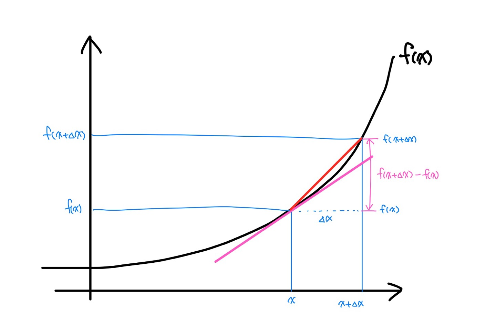
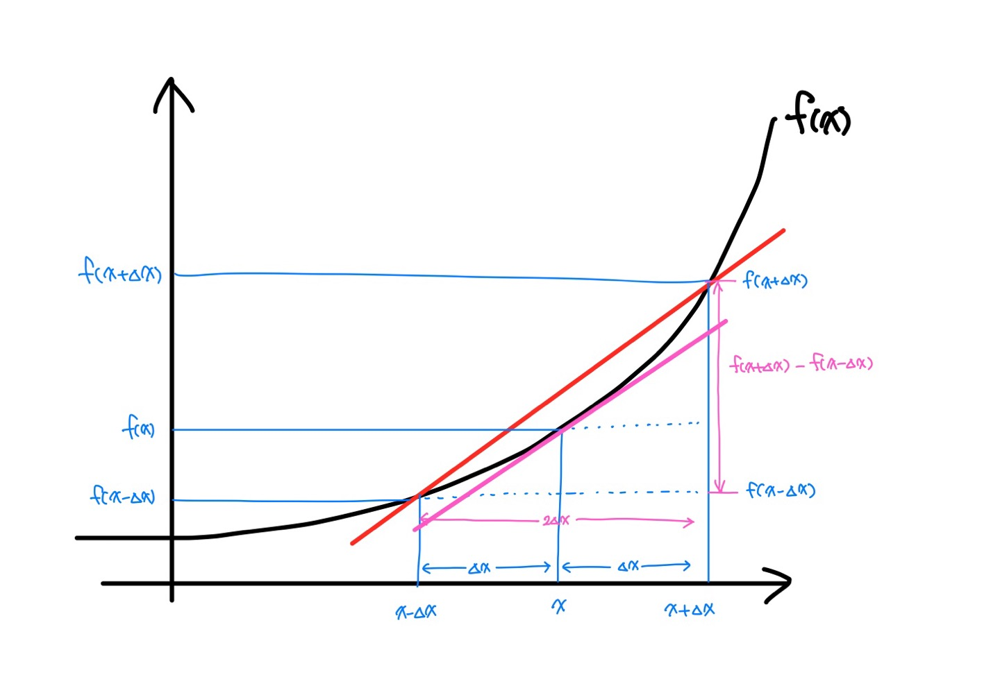

Machine learning

# Machine learning


### 01. Log

##### A) 로그 표현방식

Log는 지수를 다른 방법으로 표현한다.

> 3<sup>x</sup> = 81, x = 4 (지수방정식)
>
> log<sub>3</sub> 81 = x, x = 4 (로그방정식)

여기서 `3`은 밑, `81`은 진수 `x`는 지수라고 한다.

지수방정식은 진수가 분리된형태이고, 로그방정식은 지수가 분리된 형태이다.

##### B) 로그 종류

- 상용로그 (common logarithm) : 십진로그

  밑이 10인 로그 

  > log<sub>10</sub> (x) = log(x)

- 자연로그 (natural logarithm) : 자연로그

  밑이 자연상수 e (=2.718...) 인 로그

  > log<sub>e</sub> (x) = ln (x)

##### C) 로그를 사용하는 이유

- 수학

  지수방정식을 쉽게 해결하기 위해서 로그방정식을 이용한다.

- 머신러닝

  정규성을 높이기 위해서 사용한다.

  > 1000 ☞ log<sub>10</sub> 1000 =  log<sub>10</sub> 10<sup>3</sup> = 3
  >
  > 100000000 ☞ log<sub>10</sub> 10<sup>8</sup> = 8

### 02. derivative (미분)

##### A) 미분 개요

- 미분의 정의

  \- 어떤 함수의 정의역 속 각 점에서 독립변수 값의 변화량과 함수값으 ㅣ변화량의 비율의 극한, 극한의 집합을 치역으로 가지는 새로운 함수

  \- 함수에 대해서 특정 순간의 변화량

- 미분의 종류

  - 해석미분 : 종이와 펜을 이용해 논리적인 전개로 수행하는 미분
  - 수치미분 : 해석미분으로 해결할 수 없을 때 수치값을 이용해 미분의 근사값을 알아내는 방법

##### B)  미분

미분은 함수에 대해서 특정 순간의 변화량을 나타낸다.

즉 x에서의 작은 변화가 f(x)를 얼마나 변화시키는지를 나타낸다.

미분을 수식으로 알아보자

<table>
      <tr>
        <th style="text-align:center;"></th>
        <td >
            여기서 직선의 기울기가 비율이다.<br>
            만약 △x ⇒ 0 으로 0에 가까워지게 되면<br>
            x위치에서 f(x)의 접선이 된다.<br>
            이 기울기가 미분값(변화량)이다.
         </td>  
      </tr>
</table>

$$
\lim_{x \to 0} {f(x+\Delta x) - f(x)\over \Delta x}
$$

##### C) 수치미분

수치미분의 종류로는 **전향미분, 후향미분, 중앙차분**이 있으며 그 중 <span style="color:red">중앙차분</span>이 가장 값이 정확하기 때문에 많이 사용된다.

미분과 의미는 똑같으며, x의 좌우로 △x만큼 떨어진 곳으로 부터 계산한 값을 사용한다.

<table>
      <tr>
        <th style="text-align:center;"></th>
        <td >
            △x ⇒ 0 으로 0에 가까워지게 되면<br>
            x위치에서 f(x)의 접선이 된다.<br>
            이 기울기가 미분값(변화량)이다.
         </td>  
      </tr>
</table>

$$
\lim_{x \to 0} {f(x+\Delta x) - f(x-\Delta x)\over 2\Delta x}
$$

> 📌 프로그램에서 △x
>
> 프로그램으로 미분을 구현 할 때에 △x는 어떻게 해야할까?
>
>  △x는 0에 가까운 아주 작은 값이므로 0.000...1 의값으로 사용한다.
>
> 하지만 프로그래밍적으로 10<sup>-8</sup>이하의 값을 사용한다면 문제가 발생하기 때문에
>
> 이번 프로그래밍 실습에서는 △x값을 10<sup>-4</sup>로 설정하였다.


##### D) 기본 미분 공식

- f(x) = constant

  f'(x) = 0

- f(x) = ax<sup>n</sup>

  f'(x) = n·ax<sup>n-1</sup>

- f(x) = e<sup>x</sup>

  f'(x) = e<sup>x</sup>

- f(x) = e<sup>-x</sup>

  f'(x) = -e<sup>-x</sup>

- f(x) = ln(x) = log<sub>e</sub>(x)

  f'(x) = 1/x

##### E) 편미분 (partial deviation)

독립변수가 2개 이상인 다변수함수에서 미분하고자 하는 변수 하나를 제외한 나머지 변수를 상수로 취급해서 해당 변수를 미분하는 방법
$$
f(x,y) = 2x + 3xy + y^3
\\\\
{\delta f(x,y)  \over \delta x} = 2 + 3y
\\
{\delta f(x,y)  \over \delta y} = 3x + 3y^2
$$

##### F) 미분의 Chain Rule (연쇄법칙)

여러 함수로 구성된 합성함수를 미분할 때 사용
$$
f(x) = 3^{3x^2}
\\
\text{function1 : } e^t
\\
\text{function2 : } t = 3x^2
\\\\
{\delta f(x)\over \delta x} = {\delta f\over \delta t}\times {\delta t\over \delta x}
\\\\
f'(x) = e^t \times 6x = 6xe^{3x^2}
$$


### 03. 미분 구현

##### A) first-classes function

한국어로는 일급함수라고 하며 javascript, python에서 이를 지원한다.

일급함수는 함수가 변수에 저장될 수 있어 함수이름을 변수처럼 사용할 수 있다.

```python
def my_func3(x):
    x(20)
    
def my_func4(x):
    print(x+30)

my_func3(my_func4) # 50
```

##### B) 단변수 미분 함수

다음 중앙차분 공식을 프로그램으로 구현해보자.
$$
\lim_{x \to 0} {f(x+\Delta x) - f(x-\Delta x)\over 2\Delta x}
$$

```python
# 단변수 함수
# f(x) = x^2
# f'(x) = 2x
# f'(5) = 10

# f(x)
def my_func(x):
    return x**2

# 미분을 수행하는 함수
def numerical_derivative(f, x):
    
    delta_x = 1e-4 # 극한에 해당하는 값. 너무 작은 값을 사용하면 실수계산 오류가 발생해요.
                   # 1e-4 정도의 값을 이용하면 적당한 수치미분 값을 구할 수 있어요.
    return (f(x + delta_x) - f(x-delta_x)) / (2*delta_x)
    
    
# f'(5)
result = numerical_derivative(my_func, 5)
print(result)    # 9.999999999976694 약간 차이가 있는 근사값을 얻어낼 수 있다.
```

##### C) 다변수 미분함수

다변수 함수는 2개 이상의 변수를 가지는 함수를 말한다.

프로그램적으로 구현하여 다방면으로 활용하기 위해서는 변수가 몇개든 사용할 수 있어야 한다.

> `nditer` : 반복자 객체
>
> 하나 이상의 배열의 모든 요소를 방문할 수 있는 여러가지 유연한 방법을 제공한다.
>
> [ref](https://runebook.dev/ko/docs/numpy/reference/arrays.nditer)


```python
# 다변수 함수
# f(x,y) = 2x + 3xy + y^3
# f(a, b, c) = 3a + 3bc + b^2 + c^3

import numpy as np

def my_func(input_value):
    x = input_value[0]
    y = input_value[1]
    return 2 * x + 3 * x * y + y ** 3

result = numerical_derivative(my_func, np.array([1.0, 2.0]))
print(result)   # [ 8.         15.00000001]
```


```python
# 다변수 함수에 대한 수치미분을 수행하는 함수
def numerical_derivative(f, x):   # x   : [1.0  2.0]
                                  # 결과 : [8.0 15.0]
    delta_x = 1e-4
    derivative_x = np.zeros_like(x)  # derivative_x : [0.0 0.0] 값 저장
    
    # iterator 를 이용해서 입력변수 x에 대한 편미분을 수행
    it = np.nditer(x, flags=['multi_index'])
    
    while not it.finished:
        
        idx = it.multi_index
        tmp = x[idx]
    
        x[idx] = tmp + delta_x   # x : ndarray [1.0001 2.0]
        fx_plus_delta = f(x)
        
        x[idx] = tmp -delta_x    # x : ndarray [0.9999 2.0]
        fx_minus_delta = f(x)
        
        derivative_x[idx] = (fx_plus_delta - fx_minus_delta) / (2*delta_x)
        
        x[idx] = tmp             # x : ndarray [1.0  2.0]
        it.iternext()
        
    return derivative_x
```


다른 함수로 확인

```python
# 정상적으로 동작하는지 확인하기 위해 다른 4변수 함수를 사용하여 test

# f(x, w, y, z) = wx + xyz + 3w + zy^2
# 수치미분
# f'(1.0, 2.0, 3.0, 4.0) =?

def my_func(input_value):
    
    w = input_value[0,0]
    x = input_value[0,1]
    y = input_value[1,0]
    z = input_value[1,1]
    
    return (w*x) + (x*y*z) + (3*w) + (z*(y**2))

result = numerical_derivative(my_func, np.array([[1.0, 2.0], [3.0, 4.0]]))
print(result)
```

아아아아 어려워 ㅠㅠ


### 04. Regression (회귀)

##### A) 회귀란?

- 어떤 데이터에 대해 그 데이터에 영향을 주는 조건들의 영향력을 고려해서 데이터에 대한 조건부 평균을 구하는 기법

- 조건에 따른 가격의 변화를 그래프로 그리고, 수식으로 표현하면 활용도가 커진다.