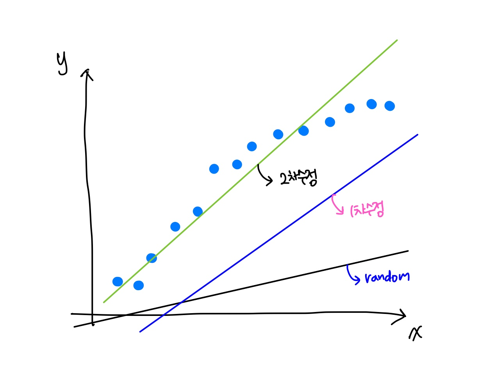
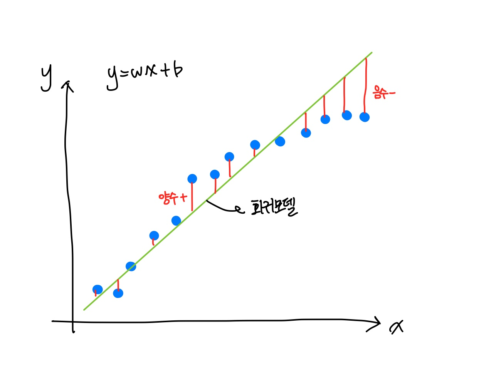
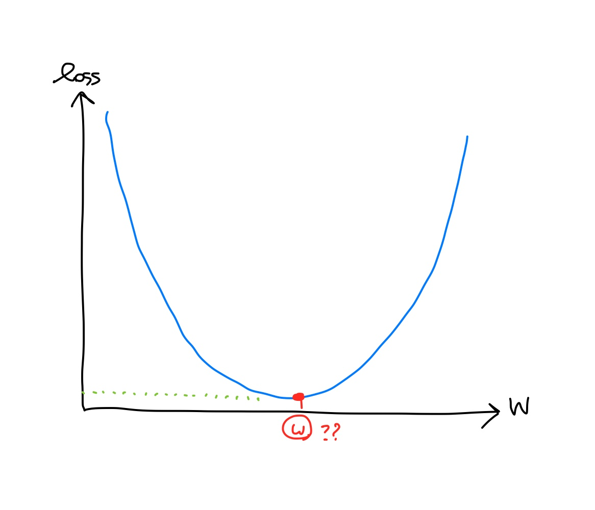
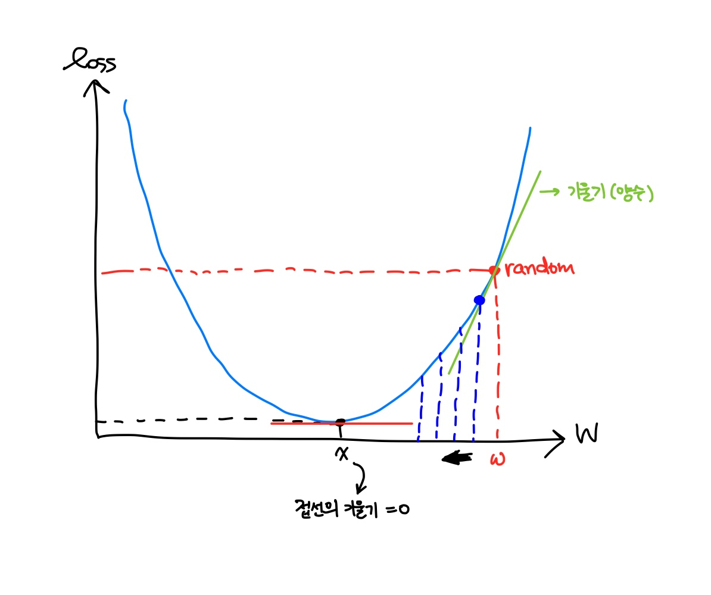

Machine learning

# Machine learning


### 01. Log

##### A) 로그 표현방식

Log는 지수를 다른 방법으로 표현한다.

> 3<sup>x</sup> = 81, x = 4 (지수방정식)
>
> log<sub>3</sub> 81 = x, x = 4 (로그방정식)

여기서 `3`은 밑, `81`은 진수 `x`는 지수라고 한다.

지수방정식은 진수가 분리된형태이고, 로그방정식은 지수가 분리된 형태이다.

##### B) 로그 종류

- 상용로그 (common logarithm) : 십진로그

  밑이 10인 로그 

  > log<sub>10</sub> (x) = log(x)

- 자연로그 (natural logarithm) : 자연로그

  밑이 자연상수 e (=2.718...) 인 로그

  > log<sub>e</sub> (x) = ln (x)

##### C) 로그를 사용하는 이유

- 수학

  지수방정식을 쉽게 해결하기 위해서 로그방정식을 이용한다.

- 머신러닝

  정규성을 높이기 위해서 사용한다.

  > 1000 ☞ log<sub>10</sub> 1000 =  log<sub>10</sub> 10<sup>3</sup> = 3
  >
  > 100000000 ☞ log<sub>10</sub> 10<sup>8</sup> = 8

### 02. derivative (미분)

##### A) 미분 개요

- 미분의 정의

  \- 어떤 함수의 정의역 속 각 점에서 독립변수 값의 변화량과 함수값으 ㅣ변화량의 비율의 극한, 극한의 집합을 치역으로 가지는 새로운 함수

  \- 함수에 대해서 특정 순간의 변화량

- 미분의 종류

  - 해석미분 : 종이와 펜을 이용해 논리적인 전개로 수행하는 미분
  - 수치미분 : 해석미분으로 해결할 수 없을 때 수치값을 이용해 미분의 근사값을 알아내는 방법

##### B)  미분

미분은 함수에 대해서 특정 순간의 변화량을 나타낸다.

즉 x에서의 작은 변화가 f(x)를 얼마나 변화시키는지를 나타낸다.

미분을 수식으로 알아보자

<table>
      <tr>
        <th style="text-align:center;"></th>
        <td >
            여기서 직선의 기울기가 비율이다.<br>
            만약 △x ⇒ 0 으로 0에 가까워지게 되면<br>
            x위치에서 f(x)의 접선이 된다.<br>
            이 기울기가 미분값(변화량)이다.
         </td>  
      </tr>
</table>

$$
\lim_{x \to 0} {f(x+\Delta x) - f(x)\over \Delta x}
$$

##### C) 수치미분

수치미분의 종류로는 **전향미분, 후향미분, 중앙차분**이 있으며 그 중 <span style="color:red">중앙차분</span>이 가장 값이 정확하기 때문에 많이 사용된다.

미분과 의미는 똑같으며, x의 좌우로 △x만큼 떨어진 곳으로 부터 계산한 값을 사용한다.

<table>
      <tr>
        <th style="text-align:center;"></th>
        <td >
            △x ⇒ 0 으로 0에 가까워지게 되면<br>
            x위치에서 f(x)의 접선이 된다.<br>
            이 기울기가 미분값(변화량)이다.
         </td>  
      </tr>
</table>

$$
\lim_{x \to 0} {f(x+\Delta x) - f(x-\Delta x)\over 2\Delta x}
$$

> 📌 프로그램에서 △x
>
> 프로그램으로 미분을 구현 할 때에 △x는 어떻게 해야할까?
>
>  △x는 0에 가까운 아주 작은 값이므로 0.000...1 의값으로 사용한다.
>
> 하지만 프로그래밍적으로 10<sup>-8</sup>이하의 값을 사용한다면 문제가 발생하기 때문에
>
> 이번 프로그래밍 실습에서는 △x값을 10<sup>-4</sup>로 설정하였다.


##### D) 기본 미분 공식

- f(x) = constant

  f'(x) = 0

- f(x) = ax<sup>n</sup>

  f'(x) = n·ax<sup>n-1</sup>

- f(x) = e<sup>x</sup>

  f'(x) = e<sup>x</sup>

- f(x) = e<sup>-x</sup>

  f'(x) = -e<sup>-x</sup>

- f(x) = ln(x) = log<sub>e</sub>(x)

  f'(x) = 1/x

##### E) 편미분 (partial deviation)

독립변수가 2개 이상인 다변수함수에서 미분하고자 하는 변수 하나를 제외한 나머지 변수를 상수로 취급해서 해당 변수를 미분하는 방법
$$
f(x,y) = 2x + 3xy + y^3
\\\\
{\delta f(x,y)  \over \delta x} = 2 + 3y
\\
{\delta f(x,y)  \over \delta y} = 3x + 3y^2
$$

##### F) 미분의 Chain Rule (연쇄법칙)

여러 함수로 구성된 합성함수를 미분할 때 사용
$$
f(x) = 3^{3x^2}
\\
\text{function1 : } e^t
\\
\text{function2 : } t = 3x^2
\\\\
{\delta f(x)\over \delta x} = {\delta f\over \delta t}\times {\delta t\over \delta x}
\\\\
f'(x) = e^t \times 6x = 6xe^{3x^2}
$$


### 03. 미분 구현

##### A) first-classes function

한국어로는 일급함수라고 하며 javascript, python에서 이를 지원한다.

일급함수는 함수가 변수에 저장될 수 있어 함수이름을 변수처럼 사용할 수 있다.

```python
def my_func3(x):
    x(20)
    
def my_func4(x):
    print(x+30)

my_func3(my_func4) # 50
```

##### B) 단변수 미분 함수

다음 중앙차분 공식을 프로그램으로 구현해보자.
$$
\lim_{x \to 0} {f(x+\Delta x) - f(x-\Delta x)\over 2\Delta x}
$$

```python
# 단변수 함수
# f(x) = x^2
# f'(x) = 2x
# f'(5) = 10

# f(x)
def my_func(x):
    return x**2

# 미분을 수행하는 함수
def numerical_derivative(f, x):
    
    delta_x = 1e-4 # 극한에 해당하는 값. 너무 작은 값을 사용하면 실수계산 오류가 발생해요.
                   # 1e-4 정도의 값을 이용하면 적당한 수치미분 값을 구할 수 있어요.
    return (f(x + delta_x) - f(x-delta_x)) / (2*delta_x)
    
    
# f'(5)
result = numerical_derivative(my_func, 5)
print(result)    # 9.999999999976694 약간 차이가 있는 근사값을 얻어낼 수 있다.
```

##### C) 다변수 미분함수

다변수 함수는 2개 이상의 변수를 가지는 함수를 말한다.

프로그램적으로 구현하여 다방면으로 활용하기 위해서는 변수가 몇개든 사용할 수 있어야 한다.

> `nditer` : 반복자 객체
>
> 하나 이상의 배열의 모든 요소를 방문할 수 있는 여러가지 유연한 방법을 제공한다.
>
> [ref](https://runebook.dev/ko/docs/numpy/reference/arrays.nditer)


```python
# 다변수 함수
# f(x,y) = 2x + 3xy + y^3
# f(a, b, c) = 3a + 3bc + b^2 + c^3

import numpy as np

def my_func(input_value):
    x = input_value[0]
    y = input_value[1]
    return 2 * x + 3 * x * y + y ** 3

result = numerical_derivative(my_func, np.array([1.0, 2.0]))
print(result)   # [ 8.         15.00000001]
```


```python
# 다변수 함수에 대한 수치미분을 수행하는 함수
def numerical_derivative(f, x):   # x   : [1.0  2.0]
                                  # 결과 : [8.0 15.0]
    delta_x = 1e-4
    derivative_x = np.zeros_like(x)  # derivative_x : [0.0 0.0] 값 저장
    
    # iterator 를 이용해서 입력변수 x에 대한 편미분을 수행
    it = np.nditer(x, flags=['multi_index'])
    
    while not it.finished:
        
        idx = it.multi_index
        tmp = x[idx]
    
        x[idx] = tmp + delta_x   # x : ndarray [1.0001 2.0]
        fx_plus_delta = f(x)
        
        x[idx] = tmp -delta_x    # x : ndarray [0.9999 2.0]
        fx_minus_delta = f(x)
        
        derivative_x[idx] = (fx_plus_delta - fx_minus_delta) / (2*delta_x)
        
        x[idx] = tmp             # x : ndarray [1.0  2.0]
        it.iternext()
        
    return derivative_x
```


다른 함수로 확인

```python
# 정상적으로 동작하는지 확인하기 위해 다른 4변수 함수를 사용하여 test

# f(x, w, y, z) = wx + xyz + 3w + zy^2
# 수치미분
# f'(1.0, 2.0, 3.0, 4.0) =?

def my_func(input_value):
    
    w = input_value[0,0]
    x = input_value[0,1]
    y = input_value[1,0]
    z = input_value[1,1]
    
    return (w*x) + (x*y*z) + (3*w) + (z*(y**2))

result = numerical_derivative(my_func, np.array([[1.0, 2.0], [3.0, 4.0]]))
print(result)
```

아아아아 어려워 ㅠㅠ


### 04. Regression (회귀)

##### A) 회귀란?

- 어떤 데이터에 대해 그 데이터에 영향을 주는 조건들의 영향력을 고려해서 데이터에 대한 조건부 평균을 구하는 기법

- 조건에 따른 가격의 변화를 그래프로 그리고, 수식으로 표현하면 활용도가 커진다.

##### B) Regression Model

- 여러가지 복잡한 조건하에서 평균을 집계할 수 있도록 하는 효율적인 방법

- 조건들을 이용해 평균을 추정할 수 있도록 하는 기법

  - 평균을 구할 때 주의해야할 사항이 regression에도 적용

    \- 정규분포를 띄는 데이터를 사용해야한다

- 회귀모델

  - 식 : 영향력<sub>1</sub> x 조건<sub>1</sub> + 영향력<sub>2</sub> x 조건<sub>2</sub> ... + 영향력<sub>n</sub> x 조건<sub>n</sub>
  - 정규분포이며, outlier가 없어야 한다.
  - 식에 포함된 영향력은 회귀계수(regression coefficient)라고 한다.

- 고전적 회귀모델(Classical Linear Regression Model)

  - 단순 선형회귀 (simple linear regression)
  - 다중 선형회귀 (multiple linear regression)

$$
\hat y = \beta_{0} + \beta_{1}x_{1} + \beta_{2}x_{2} + ... \beta_{n}x_{n}
\\
\hat y = \beta_{0} + \sum_{i=1}^p \beta_{i}x_{i}
$$

### 05. 단순 선형회귀

단순 선형회귀는 독립변수가 하나인 선형회귀모델이다.

위의 모델식이 독립변수가되면 이렇게 표현될 수 있다.
$$
y = Wx + b
$$
여기서 W는 weight로 가중치를 뜻하며, b는 bias로 바이어스라고 칭한다.

수학에서 배웠던 직선방정식과 동일한 식이다.

이제 이 식에서 데이터를 잘 나타낼 수 있는 W, b를 찾아야 한다.

##### 과정1 : learning

처음에는 w, b값을 랜덤으로 주어 표현한 다음, 데이터를 잘 표현하는 a, b값을 계속 찾아나가는 learning 방식을 사용한다.

<table>
      <tr>
        <th style="text-align:center;"></th>
        <td >
            처음 값은 random으로 시작한다.<br>
            1차, 2차 수정을 거쳐 데이터를 잘 나타내는 직선을 찾는다.<br>
         </td>  
      </tr>
</table>


##### 과정2 : MSE

만들어진 직선이 어떻게 데이터와 맞는지 알 수 있을까? 

실제값(t)와 예측값(y)의 차이인 <span style="background-color:#fff5b1;">오차</span>를 사용해서 얼마나 오차가나는지 확인할 수 있다.
$$
\text{Error} = t-y = t-(Wx+b)
$$
각 값마다 오차값이 있으니, 이 값을 통일해줄 무언가가 필요하다.

여기서 <span style="background-color:#fff5b1;">MSE(Mean Squared Error) 평균제곱오차</span>를 사용해서 확인한다.

MSE는 부호가 뒤죽박죽인 오차들의 절대값의 평균을 내는 방법이다.

- MSE를 사용해서 오차에 대한 가중치를 줄 수 있다.

- MSE는 작으면 작을수록 좋다.

$$
MSE\quad = \quad{(t_{1}-y_{1})^2 + (t_{2}-y_{2})^2 + (t_{3}-y_{3})^2 ... + (t_{n}-y_{n})^2\over n}
$$

<table>
      <tr>
        <th style="text-align:center;"></th>
        <td >
            만들어진 회귀모델과 실제값 사이의 차를 구하면 오차를 알 수 있다.<br>
            값당 하나씩 있는 오차를 하나로 표현하는 방법 중 하나로 MSE가 있다.<br>
     </td>  
  </tr>
</table>


##### 과정3 : loss function

각 값의 오차를 사용해서 만든 값인 <span style="background-color:#fff5b1;">MSE</span> 는 작을수록 오차가 작다는 의미이므로 작은 MSE 값을 찾는것을 목적으로 한다.

작은 MSE 값을 찾는 문제를 <span style="background-color:#fff5b1;">Loss Function(손실함수), Cost Function(비용함수)</span> 라고한다.

loss function은 W, b의 함수이다.
$$
E(w,b) = \quad{(t_{1}-y_{1})^2 + (t_{2}-y_{2})^2 + (t_{3}-y_{3})^2 ... + (t_{n}-y_{n})^2\over n}
\\
= \quad{(t_{1}-(wx_{1}+b))^2 + (t_{2}-(wx_{2}+b))^2 + ... (t_{n}-(wx_{n}+b))^2\over n}
\\
= \quad{1\over n}\sum_{i=1}^n[t_{i}-(wx_{i}+b)]^2
$$

<table>
      <tr>
        <th style="text-align:center;"></th>
        <td >
            실제값을 이용해서 loss function의 모양을 확인해보자<br>
            loss의 값이 최소가 되게하는 W를 찾아야 내가 가진 데이터와 가장 가까운 직선을 만들 수 있다.<br>
     </td>  
  </tr>
</table>

##### 과정4 : 경사하강법

데이터와 가장 가까운 직선을 만들려면 loss function의 값이 최소가 되게하는 W를 구해야 한다.

<span style="background-color:#fff5b1;">Gradient Descent Algorithm(경사하강법)</span> 을 사용해서 loss function의 값이 최소가 되게 하는 W를 구할 수 있다.

1. w 값을 랜덤하게 설정한다.
2. w에서 편미분해서 값을 조사한다.
3. w = w - a*편미분값
   - 현재 w 값에서 편미분한 값을 빼준다.
   - 편미분한 값이 클 수 있으니, learning rate(학습율) a를 설정해서 곱한다.
   - loss 함수가 최소가 될 때 까지 움직이면서 조사한다.

<table>
      <tr>
        <th style="text-align:center;"></th>
        <td >
            w를 random하게 잡아서 그 때의 기울기를 계산한다.<br>
            미분을 통해 기울기를 계산하고, 그 값에 a를 곱해 w에서 빼준다.<br>
            이것을 반복적으로 해주면 접선의 기울기가 0에 도달할 수 있을것이다.
     </td>  
  </tr>
</table>

### 06. 단순 선형회귀 구현

##### A) python으로 구현

```python
import numpy as np

# Training Data Set 준비
# x_data : 독립변수(공부시간)
x_data = np.array([1, 2, 3, 4, 5], dtype =np.float64).reshape(5,1) # reshape(5,-1) : 계산안할테니까 알아서 채워
# t_data => 정답데이터(시험점수)
t_data = np.array([3, 5, 7, 9, 11], dtype =np.float64).reshape(5,1)

# weight & bias 정의
W = np.random.rand(1,1)    # 1행 1열짜리 (값은1개) ndarray를 만들고
                           # 0과 1사이 균등분포에서 실수 난수를 추출
b = np.random.rand(1)

# predict function (예측 함수, 모델, hypothesis)
def predict(x):
    y = np.dot(x,W) + b
    
    return y


# loss function
def loss_func(input_data):     # loss 함수는 w와 b의 함수
                                 # input data => [W,b]
        input_W = input_data[0].reshape(1,1)
        input_b = input_data[1]
        
        # 예측값
        y = np.dot(x_data, input_W) + input_b
        
        # MSE를 구해요 (평균제곱오차)
        return np.mean(np.power(t_data-y,2))
    
# 수치미분    
def numerical_derivative(f, x):   # x    : [1.0  2.0]
                                            # 결과 : [8.0 15.0]
    delta_x = 1e-4
    derivative_x = np.zeros_like(x) # derivative_x : [0.0 0.0]
    
    # iterator 를 이용해서 입력변수 x에 대한 편미분을 수행
    it = np.nditer(x, flags=['multi_index'])
    
    while not it.finished:
        
        idx = it.multi_index
        tmp = x[idx]
    
        x[idx] = tmp + delta_x   # x : ndarray [1.0001 2.0]
        fx_plus_delta = f(x)
        
        x[idx] = tmp -delta_x    # x : ndarray [0.9999 2.0]
        fx_minus_delta = f(x)
        
        derivative_x[idx] = (fx_plus_delta - fx_minus_delta) / (2*delta_x)
        
        x[idx] = tmp             # x : ndarray [1.0  2.0]
        it.iternext()
        
    return derivative_x    

# learning rate
learning_rate = 1e-4

# 학습과정 진행
for step in range(300000):
    input_param = np.concatenate((W.ravel(), b.ravel()), axis=0) # [W b]
    derivate_result = learning_rate * numerical_derivative(loss_func, input_param)
    
    W = W - derivate_result[0].reshape(1,1)
    b = b - derivate_result[1]
    
    if step % 30000 == 0 :
        input_param = np.concatenate((W.ravel(), b.ravel()), axis=0)
        print('W:{}, b:{}, loss:{}'.format(W, b, loss_func(input_param)))
```

> W:[[0.94177277]], b:[0.99407781], loss:12.355930885525364
> W:[[1.97320749]], b:[1.09672946], loss:0.001703062723414769
> W:[[1.99028359]], b:[1.03507934], loss:0.00022398340309209348
> W:[[1.9964763]], b:[1.01272166], loss:2.945784918605578e-05
> W:[[1.99872212]], b:[1.00461356], loss:3.8742374063799574e-06
> W:[[1.99953657]], b:[1.00167313], loss:5.0953195483918e-07
> W:[[1.99983194]], b:[1.00060677], loss:6.701262358673841e-08
> W:[[1.99993905]], b:[1.00022005], loss:8.813366222411097e-09
> W:[[1.9999779]], b:[1.0000798], loss:1.1591162983377238e-09
> W:[[1.99999198]], b:[1.00002894], loss:1.5244465721056137e-10

```python
# 6시간 공부하면 몇점일지를 예측해보아요

predict_date = predict(np.array([[6]]))   # 1행 1열짜리 2차원 matrix로 만들어줌
print('6시간 공부했을 때 점수 : ',predict_date)
```

> 6시간 공부했을 때 점수 :  [[12.99999305]]

> 📌 반복학습
>
> 학습과정의 range 크기가 클수록 시간이 오래걸리고 overfitting될 수 있다.
>
> 몇번 반복학습할 것인지도 잘 조정해 주어야 한다.

##### B) sklearn으로 구현

```powershell
> pip install sklearn
```

```python
import numpy as np
from sklearn import linear_model

# Training Data Set 준비
x_data = np.array([1, 2, 3, 4, 5], dtype =np.float64).reshape(5,1)
t_data = np.array([3, 5, 7, 9, 11], dtype =np.float64).reshape(5,1)

# model 생성 (Simple Linear Model)
model = linear_model.LinearRegression()

# model 학습
model.fit(x_data, t_data)

# 학습이 끝났으니.. 구한 W 와 b를 출력해보아요
print('W:{},b:{}'.format(model.coef_, model.intercept_))

# model을 이용한 예측
model.predict(np.array([[6]]))
```


### 07. 전처리

##### A) 결치값

##### B) 이상치

- Trukey Fence

```python
import numpy as np
import matplotlib.pyplot as plt

data = np.array([1, 2, 3, 4, 5, 6, 7, 8, 9, 10, 11, 12, 13, 14, 22.1])

figure = plt.figure()

ax1 = figure.add_subplot(1,2,1)
ax2 = figure.add_subplot(1,2,2)

ax1.set_title('Original Data Boxplot')
ax1.boxplot(data)

# numpy로 사분위값을 구해서 Tufkey Fence 방식으로 이상치를 판단해 보아요
first = np.percentile(data, 25)  # 1사분위 값을 구해요
third = np.percentile(data, 75)  # 3사분위 값을 구해요
IQR_value = third - first

upper_fence = third + (IQR_value * 1.5)
lower_fence = first - (IQR_value * 1.5)

# boolean indexing을 이용해서 이상치를 추출
print(data[(data > upper_fence) | (data < lower_fence)])  # array([22.1])
#boolean indexing을 이용해서 이상치를 제거하고 나머지 데이터를 추출해요
result = data[(data <= upper_fence) & (data >= lower_fence)]

ax2.boxplot(result)

plt.show()
```

- z-score 

```python
import numpy as np
import matplotlib.pyplot as plt

data = np.array([1, 2, 3, 4, 5, 6, 7, 8, 9, 10, 11, 12, 13, 14, 22.1])

mean = data.mean()  # 8.473333333333333
std = data.std()  # 5.331974826980671

zscore_data = (data - mean) / std
zscore_data
```

- z-score을 이용한 이상치 제거

```python
from scipy import stats

data = np.array([1, 2, 3, 4, 5, 6, 7, 8, 9, 10, 11, 12, 13, 14, 22.1])

zscore_threshold = 2.0 # 일반적인 기준

outlier = data[np.abs(stats.zscore(data)) > zscore_threshold]
print(outlier)

data[np.isin(data, outlier, invert=True)]
```


##### C) 정규화

- Min-Max Scaling

```python
import pandas as pd
import seaborn as sns

titanic = sns.load_dataset('titanic')
df = titanic[['age', 'fare']]

def min_max(s):
    return (s-s.min())/(s.max()-s.min())

df = df.apply(min_max, axis=0)
df
```

정규화를 했을땐, 예측 데이터도 정규화 해주어야 하고, 결과도 정규화 이전으로 돌려주어야 한다.

```python
# result = predict([[62]])

predict_data = np.array([[62]])  # 정규화된 값으로 바꾼걸로 prediction 해야함
scaled_predict_data = scaler_x.transform(predict_data)
python_result = predict(scaled_predict_data)

print(python_result)   # [[0.04360918]]

# 정규화된 오존량이 아닌 원래 오존량을 알고싶음!!!!
# 정규화 되기 이전값으로 복원해야한다.

python_result = scaler_t.inverse_transform(python_result)
print(python_result)    # [[5.18648119]]
```


### 08. 다중선형회귀

- python

  ```python
  # 새마음 새뜻
  
  import numpy as np
  import pandas as pd
  
  ##########################################################
  # 다변수 함수에 대한 수치미분을 수행하는 함수
  def numerical_derivative(f, x):   # x    : [1.0  2.0]
                                              # 결과 : [8.0 15.0]
      delta_x = 1e-4
      derivative_x = np.zeros_like(x) # derivative_x : [0.0 0.0]
      
      # iterator 를 이용해서 입력변수 x에 대한 편미분을 수행
      it = np.nditer(x, flags=['multi_index'])
      
      while not it.finished:
          
          idx = it.multi_index
          tmp = x[idx]
      
          x[idx] = tmp + delta_x   # x : ndarray [1.0001 2.0]
          fx_plus_delta = f(x)
          
          x[idx] = tmp -delta_x    # x : ndarray [0.9999 2.0]
          fx_minus_delta = f(x)
          
          derivative_x[idx] = (fx_plus_delta - fx_minus_delta) / (2*delta_x)
          
          x[idx] = tmp             # x : ndarray [1.0  2.0]
          it.iternext()
          
      return derivative_x    
  
  
  ##############################################
  
  # Raw Data Loading
  df = pd.read_csv('./data/student_exam_score.csv')
  
  # 결측치, 이상치가 존재하지 않음
  # 각 변수의 scale 이 비슷하기 떄문에 정규화 굳이 필요하지 않을것같음
  
  # Training Data Set
  x_data = df.drop('exam', axis=1, inplace=False)
  t_data = df.iloc[:,-1].values.reshape(-1,1)
  
  # Weight, baias
  W = np.random.rand(3,1)
  b = np.random.rand(1)
  
  # loss function
  def loss_func(input_data):    # [w1, w2, w3, b]
      
      input_w = input_data[:-1].reshape(3,1)   # w 만 slicing  
      #  궁금? : 여기서 reshape 할거면 random 에서는 왜 rand(3,1)을 한걸까
      input_b = input_data[-1:]                # slicing 해서 1차원으로 나옴
      
      y = np.dot(x_data, input_w) + input_b
      
      return np.mean(np.power(t_data-y,2))    # MSE
  
  
  # predict
  def predict(x):
      y = np.dot(x, W) + b
      return y
  
  # learning rate
  learning_rate = 1e-5
  
  # 반복학습
  for step in range(300000):
      input_param = np.concatenate((W.ravel(), b.ravel()), axis=0) # [W b]
      derivate_result = learning_rate * numerical_derivative(loss_func, input_param)
      
      W = W - derivate_result[:-1].reshape(-1,1)
      b = b - derivate_result[1]
      
      if step % 30000 == 0 :
          input_param = np.concatenate((W.ravel(), b.ravel()), axis=0)
          print('W:{}, b:{}, loss:{}'.format(W, b, loss_func(input_param)))
          
  # predict
  # result = predict([[62]])    # sklearn [[3.58411393]] 
  # print(result)
      
  ```

  ```python
  # predict
  result = predict(np.array([[89, 100, 95]]))
  print(result)
  ```

- sklearn

  ```python
  # sklearn 구현
  from sklearn import linear_model
  
  model = linear_model.LinearRegression()
  
  model.fit(x_data, t_data)
  
  result_sklearn = model.predict(np.array([[89, 100, 95]]))
  print(result_sklearn)
  ```

  

### 09. TensorFlow

##### A) Setting

- 새로운 가상환경만들기

  ```powershell
  > conda create -n machine_TF15 python=3.7 openssl
  ```

- 가상환경에 도구 설치

  ```powershell
  > conda install numpy
  > conda install pandas
  > conda install matplotlib
  > conda install nb_conda
  > pip install sklearn
  > conda install seaborn
  ```

- tensorflow 설치

  ```python
  > conda install tensorflow==1.15
  ```

##### B) Error 

- **No module named 'tensorflow_core.estimator'**

    참고 : https://mickael-k.tistory.com/81pip 

    ```powershell
    # 최신 tensorflow upgrade
    > install --upgrade tensorflow
    # 1.15 버전(사용할버전)으로 downgrade
    > pip install tensorflow==1.15
    ```

- **Consider using the `--user` option or check the permissions."** 

    참고 : https://potensj.tistory.com/73

    user option을 주어서 설치하면 된다.

##### C) TensorFlow 기초

```python
# tensorflow에 대해서 알아보아요

import tensorflow as tf

# 상수 node를 만들어요!
node1 = tf.constant(10, dtype=tf.float32)
node2 = tf.constant(30, dtype=tf.float32)

node3 = node1 + node2

# Session이라는게 필요해요! 그래프를 실행시키기 위해서
sess = tf.Session()

print(sess.run(node1)) # graph를 실행시켜요! => node 1 을 실행
print(sess.run(node3)) # graph를 실행시켜요! => node 3 을 실행
print(sess.run([node1, node3]))
```

```python
import tensorflow as tf

node1 = tf.placeholder(dtype=tf.float32)  # scalar
                                            # 만약 다차원데이터가 입력될려면...
node2 = tf.placeholder(dtype=tf.float32)

node3 = node1 + node2

sess = tf.Session()

result = sess.run(node3, feed_dict={node1: 10,
                                    node2: 30})
print(result)
```


##### D) TensorFlow 구현

```python
# Q1, Q2, Q3, Exam 예제를 이용해서
# Tensorflow를 사용해서 Multiple Linear Regression을 구현해보아요~

import tensorflow as tf
import pandas as pd
import numpy as np

# Raw Data Loading
df = pd.read_csv('./data/student_exam_score.csv')
# display(df.head())

# 결측치 없고, 이상치 없고, 정규화도 필요없어요
# 데이터 전처리 안할거에요

# Training Data Set
x_data = df.drop('exam', axis=1, inplace=False)   # (25,3)
t_data = df['exam'].values.reshape(-1,1)

# Prediction
predict_data = np.array([[90,100,95]])             # (1,3)

# Placeholder
X = tf.placeholder(shape=[None,3], dtype=tf.float32)   # None : Don't care 행의 개수 신경쓰지 않는다
T = tf.placeholder(shape=[None,1], dtype=tf.float32)

# Weight, bias
# W는 어떤형태? => (3,1) 형태 랜덤하게 생성
# ★ tensorflow라서 표현 형식이 다르다!!! shape는 [3,1] 이런식으로 표현
W = tf.Variable(tf.random.normal([3,1]))   # Tensorflow 변수 : 계속 변경되는 것
b = tf.Variable(tf.random.normal([1]))

# model(hypothesis, 가설)   # y = Wx + b
H = tf.matmul(X,W) + b

# loss function
loss = tf.reduce_mean(tf.square(H-T))

# train node 를 생성해야해요
train = tf.train.GradientDescentOptimizer(learning_rate = 1e-7).minimize(loss)

# Session을 생성하고 초기화 진행 (Variable 초기화 필요)
sess = tf.Session()
sess.run(tf.global_variables_initializer())  # 초기화 구문. (그래프를 실행하기 전에 먼저 실행되어야 해요)

# 반복학습
for step in range(300000):
    _, W_val, b_val, loss_val = sess.run([train, W, b, loss], 
                                         feed_dict={X:x_data, T:t_data})
    if step % 30000 == 0:
        print('W : {}, b : {}, loss : {}'.format(W_val, b_val, loss_val))
    
```

```python
# Predict
sess.run(H, feed_dict={X: np.array([[89, 100, 95]])})
```


### 10. 수행평가

Ozone 데이터를 프로그램 총 3개로 Multiple Linear Regression 구현

1. Python 구현
2. Tensorflow 구현
3. sklearn 구현

각 방법에 따른 그래프로 표현하세요

(3방법의 그래프가 동일한 모양이 나와야겠죠)

Prediction한결과도 비슷하게 나와야 해요

데이터 전처리 (결치값, 이상치, 정규화) 필요
