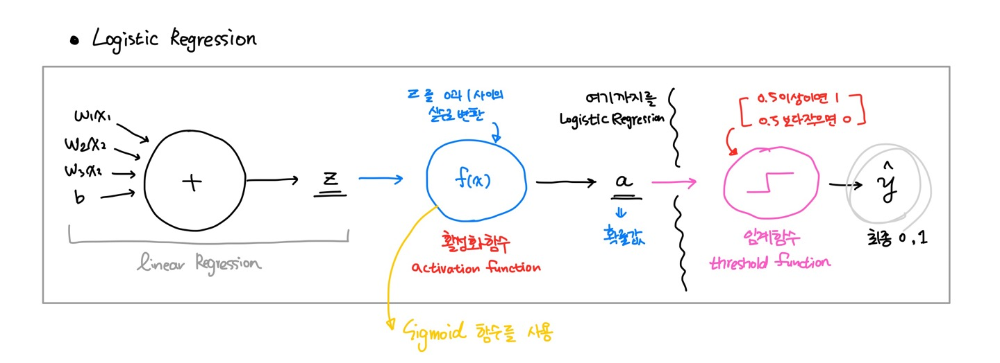
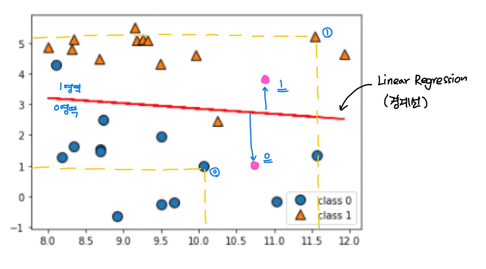
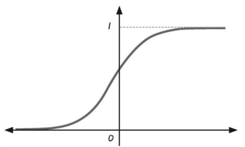
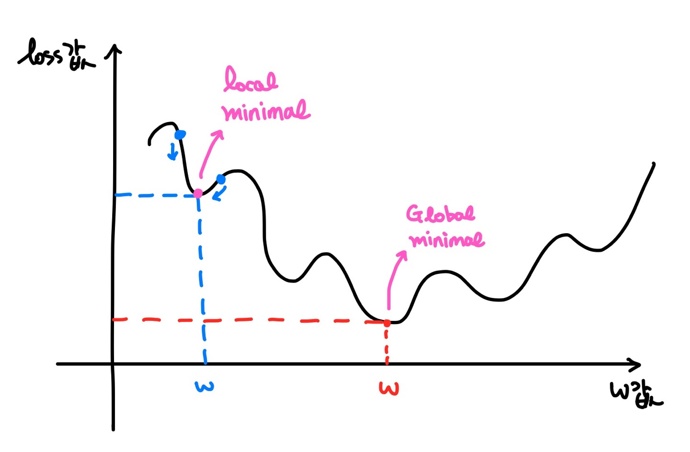

Machine learning

# Machine learning : Classification


conda install mglearn : 산포도 그래프로 과정을 확인하기 쉬움


### 01. Logistic Regression

- Classification에는 이항분류(binary classification), 다항분류(Multinomial classification)가 있다.

- Logistic Regression은 Linear Regression을 확장한 분류이다. 

- Logistic Regression은 Deep Learning으로 연결되는 기본 component 이다.

#### A) 개요

> 📌 초기 인공지능 알고리즘
>
> **Perceptron** 은 초기 인공지능 알고리즘으로, 결과값 z를 step function(계단함수)를 사용하여 0보다 크면 1, 0보다 작으면 -1로 두개의 값으로 분류했던 알고리즘이다.
>
> 그냥 초기 알고리즘이라는거지, 이게 확장되어서 지금의 알고리즘이 되었다던거는 아니다.



Logistic Regression은 Linear Regression에 활성화 함수를 적용하여 0과 1사이의 확률값 a를 결과로 만든다.

그리고 이 결과값을 임계함수를 통해 분류하여 최종 결과값을 만들게 된다.

> 👉 Logistic Regression 예시
>
> 공장생산 제품 정상/불량 판독 , CT 사진으로 암/정상 판독, 
> 주식 코인 등이 다음날 오를지/내릴지, 신용카드의 상태가 정상사용상태/도난카드 판독



다음은 mglearn에서 제공하는 dataset을 scatter그래프로 표현하고, Linear Regression 선을 그린것이다.

1. Linear Regression을 이용해서 Training Data Set의 특성과 분포를 잘 표현하는 직선을 찾는다. 
2. 이 경계선을 기준으로 0과 1로 분류된다.

이 방법은 정확도가 상당히 높아 Deep Learning의 기본 component로 사용된다.

> ❓ 그럼 이진분류문제를 Logistic Regression이 아닌 Linear Regression으로 분류하면 되지 않을까?
>
> 이상치 등의 문제에서는 Linear Regression으로 해결할 수 없는 문제가 있다.
>
> 예를들어 공부시간에 따른 합격률을 따졌을 때 100시간을 공부한 이상치가 존재한다면, 충분히 합격할 수 있는 데이터를 잘못 분류 할 수 있다.

#### B) Cross Entropy

앞서 Logistic Regression은 Linear Regression에 활성화함수를 적용하여 결과를 추출한다고 하였다.

Logistic Regression에서는 이 활성화 함수로 <span style="color:red">Sigmoid</span> 함수를 사용한다.
$$
\text Sigmoid = {1\over 1+e^{-x}}
$$


Sigmoid의 그래프는 다음과 같은 그래프로 그려지며, 이함수를 적용하면 0과 1사이의 실수로 변환된다.

<span style="color:red">Linear Regression 공식에 Sigmoid를 적용</span>하고, MSE를 사용한 loss function을 만들면 다음과 같아진다.
$$
\text {Linear Regression Model :} \quad \hat y=Wx+b \qquad\qquad\qquad\qquad
\\
\text {Linear Regression loss func :} \quad E(W,b)={1\over n}\sum_{i=1}^n[t_{i}-(wx_{i}+b)]^2
\\
\\
\text {Logistic Regression Model :} \quad \hat y = {1\over 1+e^{-(Wx+b)}} \qquad\qquad\qquad
\\
\qquad\qquad\qquad\quad\text {New loss func :} \quad E(W,b) = {1\over n}\sum_{i=1}^n\Big[t_i -({1\over e^{(Wx_i+b)}}) \Big]^2
$$



그래프를 보면 Convex(볼록)한 형태가 아닌것을 확인할 수 있다. 

지수함수(e<sup>-x</sup>)의 특성으로 모양이 구불구불하다.

이대로는 MSE를 이용한 loss function을 사용할 수 없기 때문에 식에 <span style="color:red">Log</span>를 취해주는 방식을 선택한다.

$$
\text {Logistic Regression loss function :} \quad
=-\sum_{i=1}^n \Big\{t_i \log y_i + (1-t_i) \log  (1-y_i) \Big\}
$$

> log 공식을 사용하려면 c=log<sub>b</sub>a 공식에서 a≠0의 조건이 필요하다.
>
> 그래서 혹시나 0이 들어올 것을 대비해 프로그램적으로 계산해주기 위해 약간의 delta 값을 주게 된다.

이 식을 <span style="background-color:#fff5b1;">Cross Entropy</span>  또는 log loss라고 부른다.

### 02. Logistic Regression 구현

#### A) Python

```python
# Python 구현

import numpy as np

########## 다변수 함수에 대한 수치미분을 수행하는 함수 ########

def numerical_derivative(f, x):
    
    delta_x = 1e-4
    derivative_x = np.zeros_like(x) 
    it = np.nditer(x, flags=['multi_index'])
    
    while not it.finished:
        
        idx = it.multi_index
        tmp = x[idx]
    
        x[idx] = tmp + delta_x
        fx_plus_delta = f(x)
        
        x[idx] = tmp -delta_x
        fx_minus_delta = f(x)
        
        derivative_x[idx] = (fx_plus_delta - fx_minus_delta) / (2*delta_x)
        
        x[idx] = tmp
        it.iternext()
        
    return derivative_x

################ 수치미분을 수행하는 함수 끝 ###########


# Training Data Set
x_data = np.array([2,4,6,8,10,12,14,16,18,20]).reshape(-1,1)
t_data = np.array([0,0,0,0,0,0,1,1,1,1]).reshape(-1,1)

# Weight, bias 정의
W = np.random.rand(1,1)
b = np.random.rand(1)

# Logiscit Regression model, predict model, hypothesis
def predict(x):
    z = np.dot(x,W)+b               # linear regression model
    y = 1 / (1 + np.exp(-1 * z))   # logistic regression model
    result = 0
    # 계산되는 y 값은 결국 0과 1사이의 확률값
    if y >= 0.5:
        result = 1
    else : 
        result = 0
    return y,result

# Cross Entropy(log loss)
def loss_func(input_data):  # [W,b]
    
    input_W = input_data[:-1].reshape(-1,1)
    input_b = input_data[-1]
    
    z = np.dot(x_data, input_W) + input_b
    y = 1 / (1 + np.exp(-1 *z))
    
    delta = 1e-7
    
    # cross entropy
    return -1 * np.sum(t_data*np.log(y+delta)+(1-t_data)*np.log(1-y+delta))

# learning_rate
learning_rate = 1e-4

# 반복학습
for step in range(300000):
    input_param = np.concatenate((W.ravel(), b.ravel()), axis=0) # [W b]
    derivate_result = learning_rate * numerical_derivative(loss_func, input_param)
    
    W = W - derivate_result[:-1].reshape(-1,1)
    b = b - derivate_result[-1]
    
    if step % 30000 == 0 :
        input_param = np.concatenate((W.ravel(), b.ravel()), axis=0)
        print('W:{}, b:{}, loss:{}'.format(W, b, loss_func(input_param)))  
```

```python
# prediction
study_hour = np.array([[13]])
y_prob, result = predict(study_hour)
print('합격확률:{}, 합격여부:{}'.format(y_prob, result))
# 합격확률:[[0.54438019]], 합격여부:1
```

#### B) sklearn

```python
# sklearn으로 구현
from sklearn import linear_model
ㅠ
x_data = np.array([2, 4, 6, 8,10,12,14,16,18,20]).reshape(-1,1)
t_data = np.array([0, 0, 0, 0, 0, 0, 1, 1, 1, 1])

model = linear_model.LogisticRegression()

model.fit(x_data, t_data)

study_hour = np.array([[13]])

result = model.predict(study_hour) # 최종결과만 알려준다.
result_prob = model.predict_proba(study_hour)

print('합격확률:{}, 합격여부:{}'.format(result_prob, result))
# 합격확률:[[0.50009391 0.49990609]], 합격여부:[0]
```

#### C) Tensorflow

```python
# Tensorflow 구현

import tensorflow as tf

x_data = np.array([2, 4, 6, 8,10,12,14,16,18,20]).reshape(-1,1)
t_data = np.array([0, 0, 0, 0, 0, 0, 1, 1, 1, 1]).reshape(-1,1)

# placeholdeer
X = tf.placeholder(shape=[None,1], dtype=tf.float32)
T = tf.placeholder(shape=[None,1], dtype=tf.float32)

# Weight & bias
W = tf.Variable(tf.random.normal([1,1]))
b = tf.Variable(tf.random.normal([1]))

# Model(Hypothesis)
logit = tf.matmul(X,W) + b # linear regression model
H = tf.sigmoid(logit)      # logistic regression model

# loss function
loss = tf.reduce_mean(tf.nn.sigmoid_cross_entropy_with_logits(logits=logit,
                                                              labels=T))

# train
train = tf.train.GradientDescentOptimizer(learning_rate=1e-3).minimize(loss)

# Session & 초기화
sess = tf.Session()
sess.run(tf.global_variables_initializer())

# 반복학습
for step in range(30000):
    _, W_val, b_val, loss_val = sess.run([train, W, b, loss],
                                         feed_dict={X: x_data,
                                                    T: t_data})
    if step % 3000 ==0:
        print('W:{}, b:{}, loss:{}'.format(W_val, b_val, loss_val))
```

```python
# prediction
study_hour = np.array([[13]]) # 12시간은 불합격이었고, 14시간은 합격이었어요!
result = sess.run(H, feed_dict={X: study_hour})
print('합격확률:{}'.format(result))
# 합격확률:[[0.58296657]]
```

