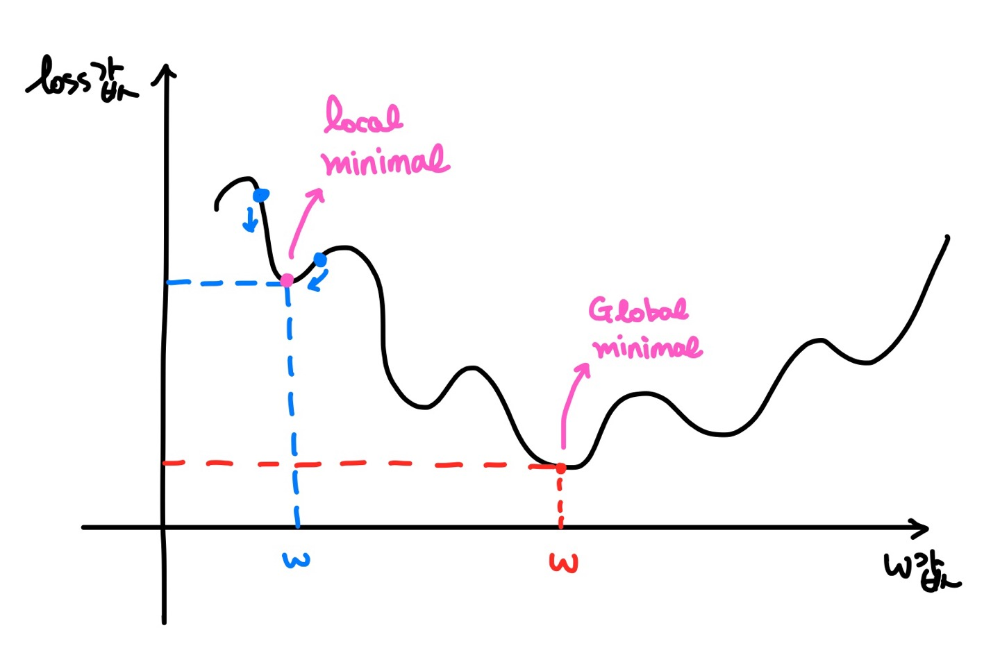

Machine learning

# Machine learning : Binary Classification


conda install mglearn : 산포도 그래프로 과정을 확인하기 쉬움


### 01. Logistic Regression

- Classification에는 이항분류(binary classification), 다항분류(Multinomial classification)가 있다.

- Logistic Regression은 Linear Regression을 확장한 분류이다. 

- Logistic Regression은 Deep Learning으로 연결되는 기본 component 이다.

#### A) 개요

> 📌 초기 인공지능 알고리즘
>
> **Perceptron** 은 초기 인공지능 알고리즘으로, 결과값 z를 step function(계단함수)를 사용하여 0보다 크면 1, 0보다 작으면 -1로 두개의 값으로 분류했던 알고리즘이다.
>
> 그냥 초기 알고리즘이라는거지, 이게 확장되어서 지금의 알고리즘이 되었다던거는 아니다.


Logistic Regression은 Linear Regression에 활성화 함수를 적용하여 0과 1사이의 확률값 a를 결과로 만든다.

그리고 이 결과값을 임계함수를 통해 분류하여 최종 결과값을 만들게 된다.

> 👉 Logistic Regression 예시
>
> 공장생산 제품 정상/불량 판독 , CT 사진으로 암/정상 판독, 
> 주식 코인 등이 다음날 오를지/내릴지, 신용카드의 상태가 정상사용상태/도난카드 판독


다음은 mglearn에서 제공하는 dataset을 scatter그래프로 표현하고, Linear Regression 선을 그린것이다.

1. Linear Regression을 이용해서 Training Data Set의 특성과 분포를 잘 표현하는 직선을 찾는다. 
2. 이 경계선을 기준으로 0과 1로 분류된다.

이 방법은 정확도가 상당히 높아 Deep Learning의 기본 component로 사용된다.

> ❓ 그럼 이진분류문제를 Logistic Regression이 아닌 Linear Regression으로 분류하면 되지 않을까?
>
> 이상치 등의 문제에서는 Linear Regression으로 해결할 수 없는 문제가 있다.
>
> 예를들어 공부시간에 따른 합격률을 따졌을 때 100시간을 공부한 이상치가 존재한다면, 충분히 합격할 수 있는 데이터를 잘못 분류 할 수 있다.

#### B) Cross Entropy

앞서 Logistic Regression은 Linear Regression에 활성화함수를 적용하여 결과를 추출한다고 하였다.

Logistic Regression에서는 이 활성화 함수로 <span style="color:red">Sigmoid</span> 함수를 사용한다.
$$
\text Sigmoid = {1\over 1+e^{-x}}
$$


Sigmoid의 그래프는 다음과 같은 그래프로 그려지며, 이함수를 적용하면 0과 1사이의 실수로 변환된다.

<span style="color:red">Linear Regression 공식에 Sigmoid를 적용</span>하고, MSE를 사용한 loss function을 만들면 다음과 같아진다.
$$
\text {Linear Regression Model :} \quad \hat y=Wx+b \qquad\qquad\qquad\qquad
\\
\text {Linear Regression loss func :} \quad E(W,b)={1\over n}\sum_{i=1}^n[t_{i}-(wx_{i}+b)]^2
\\
\\
\text {Logistic Regression Model :} \quad \hat y = {1\over 1+e^{-(Wx+b)}} \qquad\qquad\qquad
\\
\qquad\qquad\qquad\quad\text {New loss func :} \quad E(W,b) = {1\over n}\sum_{i=1}^n\Big[t_i -({1\over e^{(Wx_i+b)}}) \Big]^2
$$



그래프를 보면 Convex(볼록)한 형태가 아닌것을 확인할 수 있다. 

지수함수(e<sup>-x</sup>)의 특성으로 모양이 구불구불하다.

이대로는 MSE를 이용한 loss function을 사용할 수 없기 때문에 식에 <span style="color:red">Log</span>를 취해주는 방식을 선택한다.

$$
\text {Logistic Regression loss function :} \quad
=-\sum_{i=1}^n \Big\{t_i \log y_i + (1-t_i) \log  (1-y_i) \Big\}
$$

> log 공식을 사용하려면 c=log<sub>b</sub>a 공식에서 a≠0의 조건이 필요하다.
>
> 그래서 혹시나 0이 들어올 것을 대비해 프로그램적으로 계산해주기 위해 약간의 delta 값을 주게 된다.

이 식을 <span style="background-color:#fff5b1;">Cross Entropy</span>  또는 log loss라고 부른다.

### 02. Logistic Regression 구현

#### A) Python

```python
# Python 구현

import numpy as np

########## 다변수 함수에 대한 수치미분을 수행하는 함수 ########

def numerical_derivative(f, x):
    
    delta_x = 1e-4
    derivative_x = np.zeros_like(x) 
    it = np.nditer(x, flags=['multi_index'])
    
    while not it.finished:
        
        idx = it.multi_index
        tmp = x[idx]
    
        x[idx] = tmp + delta_x
        fx_plus_delta = f(x)
        
        x[idx] = tmp -delta_x
        fx_minus_delta = f(x)
        
        derivative_x[idx] = (fx_plus_delta - fx_minus_delta) / (2*delta_x)
        
        x[idx] = tmp
        it.iternext()
        
    return derivative_x

################ 수치미분을 수행하는 함수 끝 ###########


# Training Data Set
x_data = np.array([2,4,6,8,10,12,14,16,18,20]).reshape(-1,1)
t_data = np.array([0,0,0,0,0,0,1,1,1,1]).reshape(-1,1)

# Weight, bias 정의
W = np.random.rand(1,1)
b = np.random.rand(1)

# Logiscit Regression model, predict model, hypothesis
def predict(x):
    z = np.dot(x,W)+b               # linear regression model
    y = 1 / (1 + np.exp(-1 * z))   # logistic regression model
    result = 0
    # 계산되는 y 값은 결국 0과 1사이의 확률값
    if y >= 0.5:
        result = 1
    else : 
        result = 0
    return y,result

# Cross Entropy(log loss)
def loss_func(input_data):  # [W,b]
    
    input_W = input_data[:-1].reshape(-1,1)
    input_b = input_data[-1]
    
    z = np.dot(x_data, input_W) + input_b
    y = 1 / (1 + np.exp(-1 *z))
    
    delta = 1e-7
    
    # cross entropy
    return -1 * np.sum(t_data*np.log(y+delta)+(1-t_data)*np.log(1-y+delta))

# learning_rate
learning_rate = 1e-4

# 반복학습
for step in range(300000):
    input_param = np.concatenate((W.ravel(), b.ravel()), axis=0) # [W b]
    derivate_result = learning_rate * numerical_derivative(loss_func, input_param)
    
    W = W - derivate_result[:-1].reshape(-1,1)
    b = b - derivate_result[-1]
    
    if step % 30000 == 0 :
        input_param = np.concatenate((W.ravel(), b.ravel()), axis=0)
        print('W:{}, b:{}, loss:{}'.format(W, b, loss_func(input_param)))  
```

```python
# prediction
study_hour = np.array([[13]])
y_prob, result = predict(study_hour)
print('합격확률:{}, 합격여부:{}'.format(y_prob, result))
# 합격확률:[[0.54438019]], 합격여부:1
```

#### B) sklearn

```python
# sklearn으로 구현
from sklearn import linear_model
ㅠ
x_data = np.array([2, 4, 6, 8,10,12,14,16,18,20]).reshape(-1,1)
t_data = np.array([0, 0, 0, 0, 0, 0, 1, 1, 1, 1])

model = linear_model.LogisticRegression()

model.fit(x_data, t_data)

study_hour = np.array([[13]])

result = model.predict(study_hour) # 최종결과만 알려준다.
result_prob = model.predict_proba(study_hour)

print('합격확률:{}, 합격여부:{}'.format(result_prob, result))
# 합격확률:[[0.50009391 0.49990609]], 합격여부:[0]
```

#### C) Tensorflow

```python
# Tensorflow 구현

import tensorflow as tf

x_data = np.array([2, 4, 6, 8,10,12,14,16,18,20]).reshape(-1,1)
t_data = np.array([0, 0, 0, 0, 0, 0, 1, 1, 1, 1]).reshape(-1,1)

# placeholdeer
X = tf.placeholder(shape=[None,1], dtype=tf.float32)
T = tf.placeholder(shape=[None,1], dtype=tf.float32)

# Weight & bias
W = tf.Variable(tf.random.normal([1,1]))
b = tf.Variable(tf.random.normal([1]))

# Model(Hypothesis)
logit = tf.matmul(X,W) + b # linear regression model
H = tf.sigmoid(logit)      # logistic regression model

# loss function
loss = tf.reduce_mean(tf.nn.sigmoid_cross_entropy_with_logits(logits=logit,
                                                              labels=T))

# train
train = tf.train.GradientDescentOptimizer(learning_rate=1e-3).minimize(loss)

# Session & 초기화
sess = tf.Session()
sess.run(tf.global_variables_initializer())

# 반복학습
for step in range(30000):
    _, W_val, b_val, loss_val = sess.run([train, W, b, loss],
                                         feed_dict={X: x_data,
                                                    T: t_data})
    if step % 3000 ==0:
        print('W:{}, b:{}, loss:{}'.format(W_val, b_val, loss_val))
```

```python
# prediction
study_hour = np.array([[13]]) # 12시간은 불합격이었고, 14시간은 합격이었어요!
result = sess.run(H, feed_dict={X: study_hour})
print('합격확률:{}'.format(result))
# 합격확률:[[0.58296657]]
```


### 03. 예제

#### 예제1

admission.csv

합격, 불합격여부 판별

```python
import numpy as np
import pandas as pd
import tensorflow as tf
from sklearn import linear_model
from sklearn.preprocessing import MinMaxScaler # 정규화
from scipy import stats # 이상치 처리

import matplotlib.pyplot as plt

import warnings
warnings.filterwarnings(action='ignore')


# Raw Data Loading
df = pd.read_csv('./data/admission.csv')

#####################################
# preprocessing
#####################################

# 결측치
# df.isnull().sum() # 없음

# 이상치
# 종속변수의 이상치를 outlier
# 독립변수의 이상치를 지대값
# 1. 눈으로 쉽게 확인하는 가장 쉬운 방법 : botplot
    
# figure = plt.figure()
    
# ax1 = figure.add_subplot(1,4,1)
# ax2 = figure.add_subplot(1,4,2)
# ax3 = figure.add_subplot(1,4,3)
# ax4 = figure.add_subplot(1,4,4)
# ax1.set_title('admit')
# ax2.set_title('GRE')
# ax3.set_title('GPA')
# ax4.set_title('RANK')

# ax1.boxplot(df['admit'])
# ax2.boxplot(df['gre'])
# ax3.boxplot(df['gpa'])
# ax4.boxplot(df['rank'])

# plt.tight_layout()
# plt.show()

# boxplt으로 확인해보니 이상치 존재
# z-score을 이용해서 이상치를 제거하고 진행

zscore_threshold = 2.0

for col in df.columns:
    outlier = df[col][np.abs(stats.zscore(df[col])) > zscore_threshold]
    df = df.loc[~df[col].isin(outlier)]

# 정규화

x_data = df.drop('admit', axis=1)
t_data = df['admit'].values.reshape(-1,1)
# t_data는 0과 1로만 구성되어있어요. 따라서 정규화 필요없음

scaler = MinMaxScaler()
scaler.fit(x_data)

norm_x_data = scaler.transform(x_data)
# print(norm_x_data)

# training data set
# norm_x_data
# t_data

### sklearn 구현

model = linear_model.LogisticRegression()

model.fit(x_data, t_data)

my_score = np.array([[600, 3.8, 1]])
predict_val = model.predict(my_score)
predict_proba = model.predict_proba(my_score)

print(f'sklearn의 결과 합격여부 : {predict_val}, 확률 : {predict_proba}')


##################################
# tensorflow 구현

# training data set
# norm_x_data
# t_data

# placeholder
X = tf.placeholder(shape=[None,3], dtype = tf.float32)
T = tf.placeholder(shape=[None,1], dtype = tf.float32)

# Weight & bias
W = tf.Variable(tf.random.normal([3,1]))
b = tf.Variable(tf.random.normal([1]))

# Hypothesis, model, predict model, logistic regression model
logit = tf.matmul(X,W)+b
H = tf.sigmoid(logit)

# loss function, cross entropy, logloss라고 하기도 해요!
loss = tf.reduce_mean(tf.nn.sigmoid_cross_entropy_with_logits(logits=logit,
                                                              labels=T))

# train
train = tf.train.GradientDescentOptimizer(learning_rate=1e-4).minimize(loss)

# Session, 초기화
sess = tf.Session()
sess.run(tf.global_variables_initializer())

# 반복학습
for step in range(300000):
    _, loss_val = sess.run([train, loss], feed_dict={X: norm_x_data,
                                                 T: t_data})
    if step%30000 == 0:
        print(f'loss의 값 : {loss_val}')


```

```python
# predict
my_score = np.array([[600, 3.8, 1]])
norm_my_score = scaler.transform(my_score)

result = sess.run(H, feed_dict={X : norm_my_score})
print(f'tensorflow로 예측한 결과 : {result}')
# tensorflow로 예측한 결과는 탈락
```

```python
# Regression의 Matrics를 알아보아요

# Ozone 

import numpy as np
import pandas as pd
from sklearn import linear_model
from scipy import stats
from sklearn.model_selection import train_test_split

df = pd.read_csv('./data/ozone.csv')

# 결측치제거
training_data = df.dropna(how='any', inplace=False)

# 이상치제거
for col in training_data.columns:
    outlier = training_data[col][np.abs(stats.zscore(training_data[col])) > zscore_threshold]
    training_data = training_data.loc[~training_data[col].isin(outlier)]
    
# 정규화 x

# Data Set
x_data = training_data[['Solar.R', 'Wind','Temp']].values
t_data = training_data['Ozone'].values.reshape(-1,1)

# Train / Validation Data Set
train_x_data, valid_x_data, train_t_data, valid_t_data = \
train_test_split(x_data,
                 t_data,
                 test_size=0.3,
                 random_state=2) # random의 seed 역할

# Model
model = linear_model.LinearRegression()

# Model 학습
model.fit(train_x_data, train_t_data)

# 예측값(predict_value)
# 정답(predict_value)
predict_value = model.predict(valid_x_data)
```

#### 예제 2

위스콘신 유방암 데이터

- sklearn에서 제공하는 유방암 데이터를 가져와서 학습

- Hold-Out validation 방식과 K-Fold cross validation 방식을 비교
  👉 둘다 해보고 더 나은것으로 하는건가봐요!
- Tensorflow로 Logistic Regression구현, 정확도 측정

```python
# 위스콘신 유방암 데이터를 가지고 구현해보아요!
# 이 데이터는 sklearn이 제공하는 데이터를 사용할 꺼예요!
# sklearn과 tensorflow를 이용해서 구현해 보아요!

import numpy as np
from sklearn import linear_model   # LogisticRegression()
from sklearn.datasets import load_breast_cancer  # 데이터 로딩하기 위한 함수
from sklearn.model_selection import train_test_split  # 학습데이터와 평가데이터 분리
from sklearn.model_selection import cross_val_score  # cross validation하기 위해 필요

import warnings
warnings.filterwarnings(action='ignore')

# Raw Data Loading
cancer = load_breast_cancer()
# print(type(cancer))   # <class 'sklearn.utils.Bunch'>
                      # sklearn이 데이터를 표현하기 위해 사용하는 자료구조.
                      # python의 dictionary와 유사한 구조.
# print(cancer)      
# data라는 속성과 target이라는 속성을 가지고 있고
# data라는 속성이 독립변수, target이 종속변수
# print(cancer.data.shape, cancer.target.shape)  # (569, 30) (569,)

# print(np.unique(cancer.target, return_counts=True))  
# array([0, 1]), array([212, 357]
# print(cancer.DESCR)  # 유방암 데이터에 대한 상세 내용!
# :Missing Attribute Values: None
# :Class Distribution: 212 - Malignant(악성), 357 - Benign(정상)

# Data Set
x_data = cancer.data
t_data = cancer.target


# Hold-out validation을 위해서 train과 validation데이터를 분리
train_x_data, test_x_data, train_t_data, test_t_data = \
train_test_split(x_data,
                 t_data,
                 test_size=0.2,
                 random_state=2,
                 stratify=t_data)

model = linear_model.LogisticRegression()

# K-Fold cross validation
test_score = cross_val_score(model, x_data, t_data, scoring='accuracy', cv=5)
print(test_score)
print(test_score.mean())

# Hold-out 방식으로 validation
model.fit(train_x_data, train_t_data)
test_score = model.score(test_x_data, test_t_data)
print(test_score)

# 여기까지가 sklearn으로 구현한것
```

```python
# Tensorflow를 이용해 구현해보아요
import tensorflow as tf

## tensorflow 그래프

## placeholder
X = tf.placeholder(shape=[None,30], dtype=tf.float32)
T = tf.placeholder(shape=[None,1], dtype=tf.float32)

# Weight & bias
W = tf.Variable(tf.random.normal([30,1]))
b = tf.Variable(tf.random.normal([1]))

# Hypothesis, model, predict model, Logistic Regression
logit = tf.matmul(X,W)+b
H = tf.sigmoid(logit)

# cross entropy(loss function)
loss = tf.reduce_mean(tf.nn.sigmoid_cross_entropy_with_logits(logits=logit,
                                                              labels = T))

# train
train = tf.train.GradientDescentOptimizer(learning_rate=1e-4).minimize(loss)

# Session 초기화
sess = tf.Session()
sess.run(tf.global_variables_initializer()) # 초기화 작업

# 반복학습
# 전체 데이터를 이용해서 1번 학습하는것을 => 1 epoch(에폭)
for step in range(100000):
    _, loss_val = sess.run([train, loss], feed_dict={X: train_x_data,
                                                     T: train_t_data.reshape(-1,1)})
    if step % 10000 ==0:
        print(f'loss value : {loss_val}')

```

```python
# 정확도 측정

# validation data(test_x_data, test_t_data)를 이용해서 정확도를 측정
predict = tf.cast(H >= 0.5, dtype=tf.float32) # True는 1로, False는 0으로 바꿔준다.

correct = tf.equal(predict, T) # True, False, True....
accuracy = tf.reduce_mean(tf.cast(correct, dtype=tf.float32)) # 1, 0, 1... 나온거 mean() 해서 accuracy

accuracy_val = sess.run(accuracy, feed_dict={X: test_x_data,
                                             T: test_t_data.reshape(-1,1)})

print(f'Accuracy : {accuracy_val}')  
# Accuracy : 0.8771929740905762
```

#### 예제 3

- sklearn을 사용하여 Logistic Regression, SGD Classifier 비교
- SGD Classifier는 정규화를 거쳐야 한다.
- SGD Classifier에 L2 Regularization(규제)도 포함해서 비교 : 조금 더 나아진다.

```python
# 위스콘신 유방암 데이터셋을 이용해서 Logistic Regression을 구현해 보아요!

import numpy as np
from sklearn.datasets import load_breast_cancer
from sklearn import linear_model
from sklearn.model_selection import train_test_split
from sklearn.preprocessing import StandardScaler
import matplotlib.pyplot as plt

# Raw Data Set Loading
cancer = load_breast_cancer()

x_data = cancer.data     # 2차원 ndarray - 독립변수, feature
t_data = cancer.target   # 1차원 ndarray - 종속변수, label

train_x_data, test_x_data, train_t_data, test_t_data = \
train_test_split(x_data,
                 t_data,
                 test_size=0.3,
                 stratify=t_data,
                 random_state=2)

# Model 생성
model = linear_model.LogisticRegression()

# Model 학습
model.fit(train_x_data, train_t_data)

# accuracy로 model 평가
test_score = model.score(test_x_data, test_t_data)

print('Logistic Regression Model의 정확도 : {}'.format(test_score))
# 0.9473684210526315
```

```python
import numpy as np
from sklearn.datasets import load_breast_cancer
from sklearn import linear_model
from sklearn.model_selection import train_test_split
from sklearn.preprocessing import StandardScaler
import matplotlib.pyplot as plt

# Raw Data Set Loading
cancer = load_breast_cancer()

x_data = cancer.data     # 2차원 ndarray - 독립변수, feature
t_data = cancer.target   # 1차원 ndarray - 종속변수, label

train_x_data, test_x_data, train_t_data, test_t_data = \
train_test_split(x_data,
                 t_data,
                 test_size=0.3,
                 stratify=t_data,
                 random_state=2)

# Model 생성
sgd = linear_model.SGDClassifier(loss='log',   # logistic regression을 이용
                                 tol=1e-5,     # 얼마나 반복할건지를 loss값으로 설정 
                                 random_state=2)
# Model 학습
sgd.fit(train_x_data, train_t_data)

# Accuracy 측정
test_score = sgd.score(test_x_data, test_t_data)

print('SGDClassifier의 정확도 : {}'.format(test_score))
# 0.8947368421052632
# 왜 그럴까...???
# 정규화 안했어요!  => 각 feature마다 scale이 제각각이예요!

```

```python
import numpy as np
from sklearn.datasets import load_breast_cancer
from sklearn import linear_model
from sklearn.model_selection import train_test_split
from sklearn.preprocessing import StandardScaler
import matplotlib.pyplot as plt

# Raw Data Set Loading
cancer = load_breast_cancer()

x_data = cancer.data     # 2차원 ndarray - 독립변수, feature
t_data = cancer.target   # 1차원 ndarray - 종속변수, label

train_x_data, test_x_data, train_t_data, test_t_data = \
train_test_split(x_data,
                 t_data,
                 test_size=0.3,
                 stratify=t_data,
                 random_state=2)

# Data 정규화
scaler = StandardScaler()
scaler.fit(train_x_data)

# Model 생성
sgd = linear_model.SGDClassifier(loss='log',   # logistic regression을 이용
                                 tol=1e-5,     # 얼마나 반복할건지를 loss값으로 설정 
                                 random_state=2)
# Model 학습
sgd.fit(scaler.transform(train_x_data), train_t_data)

# Accuracy 측정
test_score = sgd.score(scaler.transform(test_x_data), test_t_data)

print('정규화를 이용한 SGDClassifier의 정확도 : {}'.format(test_score))
# 0.9649122807017544

```

```python
# 위의 코드에 L2 Regularization(규제)도 포함해 보아요!

import numpy as np
from sklearn.datasets import load_breast_cancer
from sklearn import linear_model
from sklearn.model_selection import train_test_split
from sklearn.preprocessing import StandardScaler
import matplotlib.pyplot as plt

# Raw Data Set Loading
cancer = load_breast_cancer()

x_data = cancer.data     # 2차원 ndarray - 독립변수, feature
t_data = cancer.target   # 1차원 ndarray - 종속변수, label

train_x_data, test_x_data, train_t_data, test_t_data = \
train_test_split(x_data,
                 t_data,
                 test_size=0.3,
                 stratify=t_data,
                 random_state=2)

# Data 정규화
scaler = StandardScaler()
scaler.fit(train_x_data)

# Model 생성
sgd = linear_model.SGDClassifier(loss='log',   # logistic regression을 이용
                                 tol=1e-5,     # 얼마나 반복할건지를 loss값으로 설정 
                                 penalty='l2', # L2 규제를 이용할꺼예요! 
                                 alpha=0.001,  # 규제 강도     
                                 random_state=2)
# Model 학습
sgd.fit(scaler.transform(train_x_data), train_t_data)

# Accuracy 측정
test_score = sgd.score(scaler.transform(test_x_data), test_t_data)

print('정규화를 이용한 SGDClassifier의 정확도 : {}'.format(test_score))
# 0.9649122807017544
# 규제를 이용하면 조금 더 나은 모델을 만들 수 있어요!
# 0.9707602339181286
```

#### 예제 4 : multinomial

- sklearn으로 BMI 예측모델을 만들어보고, 평가

```python
# BMI 예제 구현 - sklearn으로 먼저 구현하고 성능평가를 진행
# 성능평가의 matric은 accuracy로 진행

import numpy as np
import pandas as pd
from sklearn import linear_model
from sklearn.preprocessing import MinMaxScaler
from sklearn.model_selection import train_test_split
from sklearn.metrics import accuracy_score
from scipy import stats
import tensorflow as tf

## Raw Data Loading
df = pd.read_csv('./data/bmi.csv', skiprows=3)
# df.head()
# print(df.shape) # (20000, 3)
```

```python
## Pre-Processing

## Missing Value
# df.isnull().sum() # 결측치 없음

## Outlier
## zscore 방식
zscore_threshold=2.0
# (np.abs(stats.zscore(df['height']))>zscore_threshold).sum() # 0
# (np.abs(stats.zscore(df['weight']))>zscore_threshold).sum() # 0
# np.unique(df['label'], return_counts=True)
# 이상치도 없고 데이터의 편향도 존재하지 않는다.

## Data Split
train_x_data, test_x_data, train_t_data, test_t_data =\
train_test_split(df[['height','weight']],
                 df['label'],
                 test_size=0.3,
                 random_state=1,
                 stratify=df['label'])

## Normalization
scaler = MinMaxScaler()
scaler.fit(train_x_data)

norm_train_x_data = scaler.transform(train_x_data)
norm_test_x_data = scaler.transform(test_x_data)
```

```python
## Model 생성 후 학습 및 평가
# model = linear_model.LogisticRegression()
model = linear_model.LogisticRegression(C=100000)
# (C=1000) # 9.845 규제해도 좋아지지 않음
# 규제를 적용할 수 있어요(L2 규제)
# alpha값은 정해주어야 한다.
# C = 1 / alpha

model.fit(norm_train_x_data, train_t_data)

## 평가를 위한 예측결과를 얻어내요
predict_val = model.predict(norm_test_x_data)

acc = accuracy_score(predict_val, test_t_data)
print(f'sklearn으로 구한 Accuracy : {acc}') # 0.9851666666666666

# prediction
result = model.predict(scaler.transform(np.array([[187, 81]])))
print(result) # [1]

```

```python
## Tensorflow로 작성

# multinomial 문제이기 때문에 label을 one-hot encoding처리 해야해요
# train_t_data, test_t_data를 one-hot encoding으로 변경할건데
# tensorflow의 기능을 이용해서 변경 => tensorflow node로 생성
sess = tf.Session()

onehot_train_t_data = sess.run(tf.one_hot(train_t_data, depth=3)) # depth는 class 개수
onehot_test_t_data = sess.run(tf.one_hot(test_t_data, depth=3))

# tensorflow graph를 그려보아요!
X = tf.placeholder(shape=[None,2], dtype=tf.float32) # 독립변수의 개수
T = tf.placeholder(shape=[None,3], dtype=tf.float32) # class의 개수, logistic의 개수

# Weight & bias
W = tf.Variable(tf.random.normal([2,3]))
b = tf.Variable(tf.random.normal([3]))

# model, Hypothesis
logit = tf.matmul(X,W) + b
H = tf.nn.softmax(logit)

# loss function
loss = tf.reduce_mean(tf.nn.softmax_cross_entropy_with_logits_v2(logits=logit,
                                                                 labels=T))

# train
train = tf.train.GradientDescentOptimizer(learning_rate=1e-1).minimize(loss)

# session 초기화
sess.run(tf.global_variables_initializer())

# 반복
# 반복학습할때 주의해야 할 점이 있어요
# 학습데이터의 사이즈가 매우 크면 메모리에 데이터를 한번에 모두 loading할 수 없어요
# memory fault 나면서 수행이 정지된다.
# 어떻게 해결해야 하나요? => batch 처리 
# batch 처리 시 상대적으로 시간이 더 오래 걸린다.

num_of_epoch = 1000    # 학습을 위한 전체 epoch 수
num_of_batch = 100      # 한번에 학습할 데이터 양

for step in range(num_of_epoch):
    total_batch = int(norm_train_x_data.shape[0] / num_of_batch)
    
    for i in range(total_batch):
        batch_x = norm_train_x_data[i*num_of_batch:(i+1)*num_of_batch]
        batch_y = onehot_train_t_data[i*num_of_batch:(i+1)*num_of_batch]
        _, loss_val = sess.run([train, loss], feed_dict={X: batch_x,
                                                         T: batch_y})

    if step % 100 == 0:
        print(f'loss val : {loss_val}')
    

```

```python
# 학습이 종료되었어요!

# 성능평가(Accuracy)를 해야해요!
# result = sess.run(H, feed_dict={X:scaler.transform(np.array([[187,81]]))})
# print(result)
# print(np.argmax(result, axis=1)) # 가장 큰 값의 index를 알려줘요!
predict = tf.argmax(H,1)
correct = tf.equal(predict, tf.argmax(T,1))
accuracy = tf.reduce_mean(tf.cast(correct, dtype=tf.float32))

result = sess.run(accuracy, feed_dict={X:norm_test_x_data,
                                       T:onehot_test_t_data})
print(result)
```

