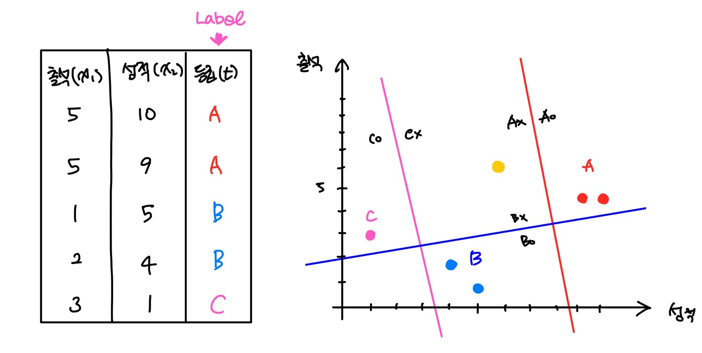
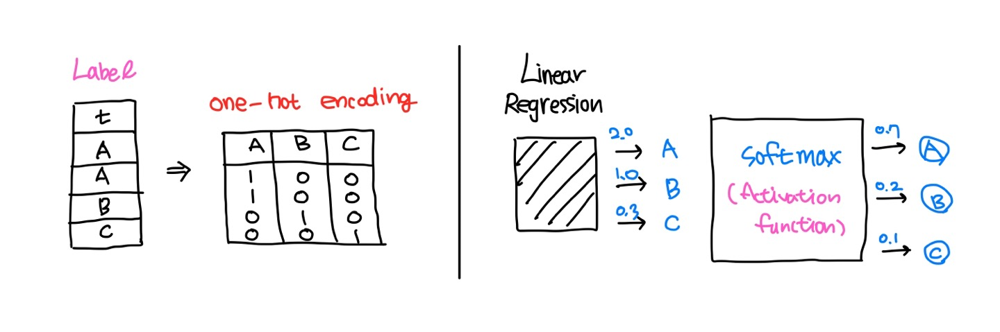
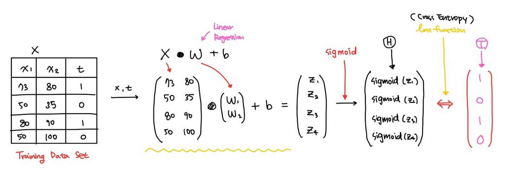
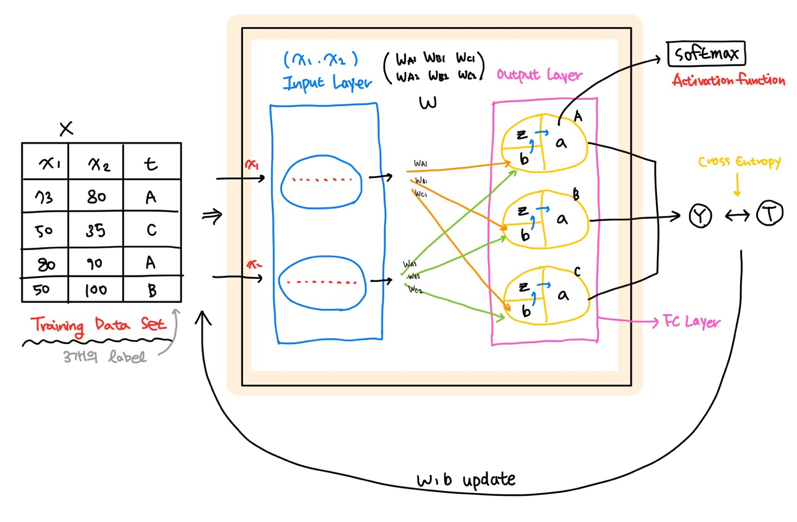

Machine learning

# Machine learning : Multinomial Classification


### 01. Multinomial Classification

다중분류(Multinomial Classification)는 class가 여러개인 분류를 말한다.

다음은 성적별 등급을 그래프로 표현한 그림이다.



여기서 등급은 Label로 A, B, C 총 3개의 Label이 있는것을 확인할 수 있다.

데이터를 토대로 노란색 데이터의 등급을 추측하는것을 Multinomial Classification으로 분류한다.



- 우선 Label을 one-hot encoding으로 연산 가능한 숫자로 바꾸어주는 작업을 해야한다

- 각 Label에 대해서 linear regression을 수행하여 그것을 기준으로 새로운 데이터에 대해 각 클래스에 대한 확률을 구하여 전체 클래스에 대한 확률을 구하게 된다.

  

A에 대한 수식을 나타내면다음과 같다.

$$
\text {grade A :}\quad
\begin{pmatrix}
x_{11}&x_{12} \\
x_{21}&x_{22}\\
x_{31}&x_{32}\\
\vdots & \vdots
\end{pmatrix}
\times
\begin{pmatrix}
w_{A1} \\
w_{A2}\\
\end{pmatrix}
+b_A=
\begin{pmatrix}
x_{11}w_{A1}+x_{12}w_{A2}+b_A \\
x_{21}w_{A1}+x_{22}w_{A2}+b_A\\
x_{31}w_{A1}+x_{32}w_{A2}+b_A\\
\vdots
\end{pmatrix}
$$
이를 모든 class에 대해 적용하면 식은 다음과 같아진다.
$$
\text {Matrix :}\quad
\begin{pmatrix}
x_{11}&x_{12} \\
x_{21}&x_{22}\\
x_{31}&x_{32}\\
\vdots & \vdots
\end{pmatrix}
\times
\begin{pmatrix}
w_{A1}&w_{B1}&w_{C1} \\
w_{A2}&w_{B2}&w_{C2}\\
\end{pmatrix}
+
\begin{pmatrix}
b_A&b_B&b_C
\end{pmatrix}
=
\begin{pmatrix}
\ldots&\ldots&\ldots\\
\ldots&\ldots&\ldots\\
\ldots&\ldots&\ldots
\end{pmatrix}
$$

이전에 이진분류(binary logistic classification)에서는 signoid model을 사용하였다. 
Multinomial Logistic Classification에서는 <span style="background-color:#fff5b1;">softmax</span>를 model로 사용한다. 

model이 변경되었으니 Loss function(Cross Entropy)도 변경된다.

### 02. Keras

#### A) MNIST

Multinomial Classification (다중분류)의 예로 MNIST가 있다.

MNIST는 사람의 손글씨로 쓴 숫자 이미지 데이터이다.

👉 **이미지 데이터**

- 이미지는 pixel로 이루진 pixel의 집합이다.
- 이미지는 2차원의 데이터에 pixel당 3개의 색을 가질 수 있기 때문에 총 3차원이다.
- 컬러의 경우에는 3차원이지만, 흑백의 경우 2차원으로도 표현이 가능하다.

👉 **이미지 데이터 입력하기**

- 흑백의 이미지도 입력데이터로 입력하게 되면 2차원의 형태로 들어가지게 된다. 
  여기서 이미지가 1개가 아닌 여러개라면 3차원의 형태가 된다.
- MNIST의 데이터는 이미지가 2차원이 아닌 ravel() 이 적용된 1차원 데이터이다.
  (이미 이미지에 대한 전처리는 다 되어있다.)

#### B) Tensorflow

👉 **Tensorflow 1.5**

- Tensorflow 1.5버전은 CPU, GPU 버전이 따로 존재한다.
- 배운이론을 코드로 이해하기는 좋지만, 코드가 너무 어렵다.
  그래서 나온것이 Tensorflow 2.0 ❕

👉 **Tensorflow 2.x**

- Keras 창시자가 google에 입사하여 Tensorflow에 Keras를 심어주었다.
- Tensorflow2.x 버전은 CPU, GPU 버전이 따로 존재하지 않는다.
- 원래 Lazy Excution에서 <span style="background-color:#fff5b1;">Eager Execution</span>(즉시실행모드) 로 변경되어 session, placeholder가 없어졌다.
- <span style="background-color:#fff5b1;">Keras</span>를 사용할 수 있다.

👉 **Tensorflow 설치하기**

- Tensorflow 2.x 버전 설치

    tensorflow는 각 환경에 맞는 버전으로 설치된다.

    Tensorflow 2.x를 사용할 수 있는 가상환경 새로 만들어 사용할 모듈을 설치한다.

    ```python
    > conda create -n machine_TF2 python=3.8 openssl
    ```

    ```python
    > conda activate machine_TF2
    > conda install numpy pandas matplotlib nb_conda tensorflow
    > pip install sklearn
    ```

- Tensorflow 버전 확인하기

    `print(tf.__version__)`를 사용해서 tensorflow의 버전을 확인할 수 있다.

    Tensorflow 2.x 버전은 Eager Execution (즉시 실행모드)를 지원한다.

    - session을 사용하지 않아도 node를 실행시켜서 값을 알아낼 수 있다.
    - 초기화 코드를 사용하지 않는다.
    - placeholder를 사용하지 않는다.

    ```python
    import tensorflow as tf
    print(tf.__version__) # 2.3.0
    
    W = tf.random.normal([1], dtype=tf.float32)
    
    print(W.numpy()) # [-0.40402368]
    ```

#### C) Keras

##### ◆ Multiple Logistic Regression

다음은 Multiple Logistic Regression을 표현한 것이다.

- Data Set에서 X data 는 Linear Regression을 거쳐 각 데이터에 대한 확률값을 계산한다.
- 계산된 확률값은 sigmoid model을 통해 결과값을 만들게 된다.
- 정답 T와 비교하며 loss function(Cross Entropy)를 사용하여 식에 맞는 W, b값을 찾는다.



##### ◆ Keras binary classification

Keras에는 <span style="background-color:#fff5b1;">Model</span>이라는 개념이 있다.

Model은 layer로 구성되어있고, layer를 통해 연산을 수행한다.

- Training Data가 Model의 Input Layer를 통해 passing by 된다.
  ( 아무런 동작을 하지않고 x 데이터를 불러들여오기만 한다. )
- Model 안에 있는 w 값이 x값과 곱해져 Output Layer로 이동한다.
- Output layer에서 Logistic Regression 연산이 수행된다.
  xW 에 b를 더한 후 Linear Regression 연산하고 sigmoid model을 사용해서 결과를 만든다.
- 결과 y 값이 만들어지고, 이를 정답값 T와 비교하고 W,b update를 수행한다.


##### ◆ Keras multinomial classification

multinomial일 경우 이렇게 표현한다.

- Input Layer 까지는 이전과 같다
- Output Layer에는 각 class 별 계산결과를 내줄 Node가 존재한다. 
  Input Layer를 통해 온 x 데이터는 Model에 존재하는 W와 연산되어 각 Node로 전해진다.
  각 Node에 전부 전달되기 때문에 이 Layer를 <span style="background-color:#fff5b1;">FC Layer</span> (Full Connected Layer) 라고 부른다.
- multinomial 분류에는 softmax model이 사용된다.
  b를 더하고 linear regression을 마친 뒤 softmax model을 사용하여 y값을 만든다.
- 만들어진 결과 y값을 정답 t값과 대조하여 W,b를 업데이트한다.



##### ◆ Keras use

Keras를 사용하기 위해서는 위에서 그림으로 설명한것들을 코드로 구현해야 한다.

우선 Keras Model은 `Sequential()`을 사용해서 생성된다.

이후 `add()` 를 사용해서 Model안의 Layer를 생성해준다.

`compile()` 를 사용하여 loss종류와 optimizer종류를 설정한다.

학습을 할 때는 `fit()`을 사용한다.

모델 평가시에는 `evaluate()`를 사용하고 예측값을 도출할 때에는 `predict()`를 사용한다.

모델 저장 시에 `save()`를 사용해서 저장할 수있다.

> 📌 모델저장
>
> 학습한 후 모델이 메모리에 저장되어있다.
> 메모리에 저장된 모델은 프로그램을 종료하면 없어진다.
>
> keras에서는 모델을 저장하고 다시불러와서 재학습이 가능하다.
> 이를 통해 시간을 절약할 수 있고, 다른사람과 공유도 가능하다.
>
> 모델저장방법에는 두가지가 있다.
>
> - 모델구조와 W, b를 같이저장 : 편하지만 사이즈가 크다
> - W, b만 저장 : 크기가 작지만, 사용하려면 모델을 만들고 W, b를 로딩해야한다.


### 03. 예제

#### 예제1 

- MNIST 예제 : 마지막 tensorflow 1.5

```python
# MNIST 예제를 구현해보아요
# Data는 Kaggle 에서 다운로드
import pandas as pd
import numpy as np
import tensorflow as tf
import matplotlib.pyplot as plt
from sklearn.preprocessing import MinMaxScaler
from sklearn.model_selection import train_test_split

import warnings
warnings.filterwarnings(action='ignore')


# Raw Data Loading
df = pd.read_csv('./data/mnist/train.csv')
display(df.shape)
```

```python
# 데이터 전처리
# 결측치나 이상치가 존재하지 않아요
# 단, 정규화는 필요해요 (scale의 차이가 나서 0,255)
# 이미지 확인

figure = plt.figure()
ax_arr = [] # python list

img_data = df.drop('label', axis=1, inplace=False).values

for n in range(10):
    ax_arr.append(figure.add_subplot(2,5,n+1))
    ax_arr[n].imshow(img_data[n].reshape(28,28),
                     cmap='Greys',            # 흑백이미지 표현
                     interpolation='nearest') # 보간법 : 이미지 깔끔하게 보이게
plt.tight_layout()
plt.show()
```

```python
# Data Split
train_x_data, test_x_data, train_t_data, test_t_data =\
train_test_split(df.drop('label', axis=1, inplace=False),
                 df['label'],
                 test_size=0.3,
                 random_state=1,
                 stratify=df['label'])

# 정규화
scaler = MinMaxScaler()
scaler.fit(train_x_data)

norm_train_x_data = scaler.transform(train_x_data)
norm_test_x_data = scaler.transform(test_x_data)

```

```python
## Tensorflow Implementation ##
sess = tf.Session()

onehot_train_t_data = sess.run(tf.one_hot(train_t_data, depth=10))
onehot_test_t_data = sess.run(tf.one_hot(test_t_data, depth=10))

# placeholder
X = tf.placeholder(shape=[None,784], dtype=tf.float32)
T = tf.placeholder(shape=[None,10], dtype=tf.float32)

# Weight & bias
W = tf.Variable(tf.random.normal([784,10]))
b = tf.Variable(tf.random.normal([10]))

# Hypothesis, Model
logit = tf.matmul(X,W) + b
H = tf.nn.softmax(logit)

# Loss function
loss = tf.reduce_mean(tf.nn.softmax_cross_entropy_with_logits_v2(logits=logit,
                                                                 labels=T))

# train
train = tf.train.GradientDescentOptimizer(learning_rate=1e-1).minimize(loss)

# session, 초기화
sess.run(tf.global_variables_initializer())

# 반복학습
num_of_epoch = 1000
batch_size = 100

for step in range(num_of_epoch):
    
    total_batch = int(norm_train_x_data.shape[0] / batch_size)

    for i in range(total_batch):
        batch_x = norm_train_x_data[i*batch_size:(i+1)*batch_size]
        batch_y = onehot_train_t_data[i*batch_size:(i+1)*batch_size]
        
        _, loss_val = sess.run([train, loss], feed_dict={X:batch_x,
                                                         T:batch_y})
    if step % 100 == 0:
        print('loss val : {}'.format(loss_val))
```

```python
# accuracy 측정
predict = tf.argmax(H,1)
correct = tf.equal(predict, tf.argmax(T,1))
accuracy = tf.reduce_mean(tf.cast(correct, dtype=tf.float32))

accuracy_val = sess.run(accuracy, feed_dict={X: norm_test_x_data,
                                             T: onehot_test_t_data})
print(f'Accuracy : {accuracy_val}')
```

#### 예제 2 : Keras

```python
# 대표적인 multinomial 예제인 MNIST를 이용해서 
# Tensorflow 2.x 버전으로 구현해보아요

import numpy as np
import pandas as pd
import tensorflow as tf
from tensorflow.keras.models import Sequential
from tensorflow.keras.layers import Flatten, Dense # Flatten(input layer)
                                                    # Dense(output layer)
from sklearn.preprocessing import MinMaxScaler
from sklearn.model_selection import train_test_split
    
# Raw Data Loading

df = pd.read_csv('./data/mnist/train.csv')
display(df.head())
```

```python
# Data Split
train_x_data, test_x_data, train_t_data, test_t_data = \
train_test_split(df.drop('label', axis=1, inplace=False),
                 df['label'],
                 test_size=0.3,
                 random_state=1,
                 stratify=df['label'])

# 정규화
scaler = MinMaxScaler()
scaler.fit(train_x_data)

norm_train_x_data = scaler.transform(train_x_data)
norm_test_x_data = scaler.transform(test_x_data)

```

```python
# Tensorflow 2.x 구현

# model 생성
model = Sequential()

# layer 추가
# w는 model을 만드는 순간 인자를보고 지정된다.
# input layer는 하는일 없어서 코드 한번에 쓸수있는데 나중에 해봐요~
model.add(Flatten(input_shape=(norm_train_x_data.shape[1],)))

model.add(Dense(units=10,
                activation='softmax'))

print(model.summary())
```

```python
# model compile
# 사용할 loss 함수를 지정, 사용한 optimizer(w,b 업데이트 알고리즘)를 지정
from tensorflow.keras.optimizers import SGD, Adam

# loss
# linear regression : linear :: linear regression의 loss (MSE)
# binary classification : binary_crossentropy
# multinomial classification : categorical_crossentropy (onehot 처리 필요)
# multinomial classification : sparse_categorical_crossentropy (onehot 처리가 필요없음)

model.compile(optimizer=SGD(learning_rate=1e-3),
              loss='sparse_categorical_crossentropy',
              metrics=['accuracy'])

# 학습결과를 변수에 저장
history = model.fit(norm_train_x_data,
                    train_t_data,
                    epochs=100,
                    batch_size=100,
                    verbose=1,
                    validation_split=0.2)
```

```python
print(model.evaluate(norm_test_x_data, test_t_data))
#       loss              accuracy
# [0.4791148602962494, 0.8763492107391357]
```

예제 : Keras 저장

```python
# 대표적인 multinomial 예제인 MNIST를 이용해서 
# Tensorflow 2.x 버전으로 구현해보아요

import numpy as np
import pandas as pd
import tensorflow as tf
from tensorflow.keras.models import Sequential
from tensorflow.keras.layers import Flatten, Dense # Flatten(input layer)
                                                    # Dense(output layer)
from sklearn.preprocessing import MinMaxScaler
from sklearn.model_selection import train_test_split
from tensorflow.keras.optimizers import SGD, Adam
from tensorflow.keras.callbacks import ModelCheckpoint
    
# Raw Data Loading

df = pd.read_csv('./data/mnist/train.csv')
display(df.head())
```

```python
# Data Split
# 기존에는 test_x_data, test_t_data 이 두데이터를 validation 용도로 사용
# 이제는 test_x_data, test_t_data 이 두 데이터를 test 용도로 사용할거에요
# 최종 모델 성능 평가를 위해 딱 1번만 사용할거에요
# 그럼 validation은 어떻게 하나요?
# keras는 학습할 때 train data를 일정부분 나누어서 자체 validation이 가능
# keras 기능을 이용하여 validation 처리

train_x_data, test_x_data, train_t_data, test_t_data = \
train_test_split(df.drop('label', axis=1, inplace=False),
                 df['label'],
                 test_size=0.3,
                 random_state=1,
                 stratify=df['label'])

# 정규화
scaler = MinMaxScaler()
scaler.fit(train_x_data)

norm_train_x_data = scaler.transform(train_x_data)
norm_test_x_data = scaler.transform(test_x_data)

# loss 지정할 때 sparse_categorical_crossentropy로 loss함수를 지정할 예정이기 때문에
# target(label)에 대한 onehot encoding 처리가 필요없다.
```

```python
# Tensorflow 2.x 구현

# model 생성
model = Sequential()

# layer 추가
model.add(Flatten(input_shape=(norm_train_x_data.shape[1],)))

model.add(Dense(units=10,
                activation='softmax'))

# model compile
# 사용할 loss 함수를 지정, 사용한 optimizer(w,b 업데이트 알고리즘)를 지정

# loss
model.compile(optimizer=SGD(learning_rate=1e-3),
              loss='sparse_categorical_crossentropy',
              metrics=['accuracy'])

#----------------------check point------------------------
# model을 저장하려고 해요. model구조는 빼고 weight, b 만 저장
checkpoint_path = './training_ckpt/cp.ckpt'
# checkpoint_dir = os.path.dirname(checkpoint_path) # 실제 경로로 만들어요
cp_callback = ModelCheckpoint(filepath=checkpoint_path,
                              save_weights_only=True,
                              verbose=1)

#---------------------------------------------------------

# 학습결과를 변수에 저장
history = model.fit(norm_train_x_data,
                    train_t_data,
                    epochs=100,
                    batch_size=100,
                    verbose=1,  # 0으로 설정 시 출력이 나오지 않는다.
                    validation_split=0.2,
                    callbacks=[cp_callback]) # checkpoint 에 저장
# 평가진행

print(model.evaluate(norm_test_x_data, test_t_data))
#       loss              accuracy
# [0.47676777839660645, 0.8751587271690369]
```

```python
%reset
# 불러서 다시 사용하려면 어떻게 해야하나요?

# 확인하기 위해...
# 학습하지 않은 상태로 evaluation을 진행하면 당연히 평가결과가 좋지않겠죠?

# 대표적인 multinomial 예제인 MNIST를 이용해서 
# Tensorflow 2.x 버전으로 구현해보아요

import numpy as np
import pandas as pd
import tensorflow as tf
from tensorflow.keras.models import Sequential
from tensorflow.keras.layers import Flatten, Dense # Flatten(input layer)
                                                    # Dense(output layer)
from sklearn.preprocessing import MinMaxScaler
from sklearn.model_selection import train_test_split
from tensorflow.keras.optimizers import SGD, Adam
from tensorflow.keras.callbacks import ModelCheckpoint
    
# Raw Data Loading

df = pd.read_csv('./data/mnist/train.csv')
display(df.head())

# Data Split
train_x_data, test_x_data, train_t_data, test_t_data = \
train_test_split(df.drop('label', axis=1, inplace=False),
                 df['label'],
                 test_size=0.3,
                 random_state=1,
                 stratify=df['label'])

# 정규화
scaler = MinMaxScaler()
scaler.fit(train_x_data)

norm_train_x_data = scaler.transform(train_x_data)
norm_test_x_data = scaler.transform(test_x_data)

# Tensorflow 2.x 구현

# model 생성
model = Sequential()

# layer 추가
model.add(Flatten(input_shape=(norm_train_x_data.shape[1],)))

model.add(Dense(units=10,
                activation='softmax'))

# model compile
model.compile(optimizer=SGD(learning_rate=1e-3),
              loss='sparse_categorical_crossentropy',
              metrics=['accuracy'])

# 원래 학습을 진행하지 않고 최종평가 진행
# 평가진행
print(model.evaluate(norm_test_x_data, test_t_data))
#                loss              accuracy
# 학습 x [2.4072484970092773, 0.11619047820568085]
```

```python
# 이번엔ㄴ checkpoint 파일에 있는 weight를 load 한 후
# evaluation 시켜보아요

checkpoint_path = './training_ckpt/cp.ckpt'
model.load_weights(checkpoint_path)
print(model.evaluate(norm_test_x_data, test_t_data))
# [0.47676777839660645, 0.8751587271690369]
```

