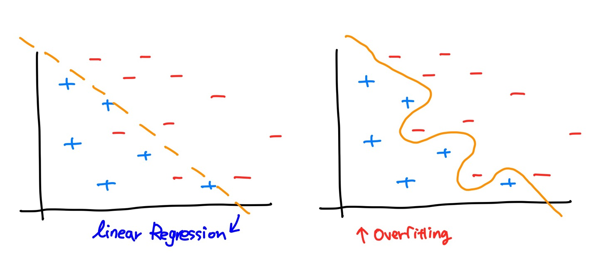
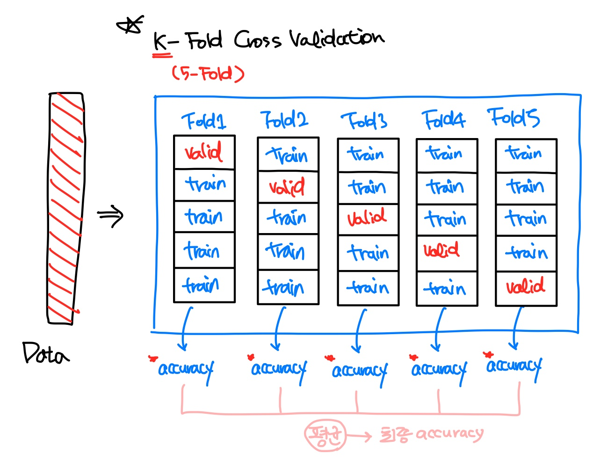

Machine learning

# Machine learning : 성능평가

ML을 구현할때는 sklearn을 많이 사용한다. 

그리고 sklearn은 잘만들어져 있어서 거의 정답에 가깝다고 한다.

그러면 sklearn이외 python, tensorflow의 구현이 잘 되었는지 확인하는 방법은 어떤게 있을까?

이를 확인하는 것을 평가지표(Metrics)라고 한다.

### 01. Evaluation

성능평가를 진행 할 때, Training Data Set으로 학습한 뒤, Training Data Set을 이용해서 evaluation을 하면 안된다.

그래서 보통 아래와 같이 데이터를 분할하여 사용한다.

<table>
    <tr>
        <td colspan='3' style="text-align:center;"
            bgcolor="#FFFFFF">Original Data Set</td>
    </tr>
    <tr>
        <td colspan='2' style="text-align:center;"
            bgcolor="#FFFFFF">Training Data Set</td>
        <td style="text-align:center;"
            bgcolor="#FFFFFF">Test Data Set</td>
    </tr>
    <tr>
        <td style="text-align:center;"
            bgcolor="#FFFFFF">Training Data Set</td>
        <td style="text-align:center;"
            bgcolor="#FFFFFF">Validation Data Set</td>
        <td style="text-align:center;"
            bgcolor="#FFFFFF">Test Data Set</td>
    </tr>
</table>
- Training Data Set : 학습 데이터 셋
- Validation Data Set : Model 수정을 위한 평가 데이터 셋
- Test Data Set : 최종 성능을 평가 (evaluation) 하기 위해서 사용

##### A) Validation

Validation Data Set은 모델이 잘 만들어졌는지 그렇지 않은지 자체 평가를 하기 위한 Data Set이다.

- Hold-Out Validation
  - 위와 같이 Training Data Set의 일부를 평가를 위해 희생하는 방식
  - 단점1 : Training Data Set이 작아진다
  - 단점2 : 데이터의 편향이 생길 수 있다는 단점이 있다.
- K-Fold Cross Validation

### 02. Reression의 Metrics

##### A) MAE (Mean Absolute Error)

- 예측값과 정답의 차이를 절대값으로 평균낸 값
- 직관적이고 단위가 같다.
- scale에 따라 의존적이다.

##### B) MSE (Mean Squared Error)

$$
\text{MSE = }{1\over n}\sum(t-\bar y)^2
$$

- MAE 보다 error에 가중치(제곱)을 주는 Metrics
- 이상치에 더 민감하다

##### C) RMSE ( Root Mean Squared Error)

$$
\text{RMSE = }\sqrt{{1\over n}\sum(t-\bar y)^2}
$$

- MSE에 Root를 취한 Metrics

##### D) MAPE (Mean Absolute Percentage Error)

$$
\text{MAPE = }{100\%\over n}\sum{(|{t-\bar y\over t}|)}
$$

- MAE의 100분율을 표현
- 값이 작을수록 좋은 모델이다.

##### E) R squared

$$
\text{R squared = }{\text{예측값의 variance}\over \text{정답의 variance}}
$$

- 분산을 기반으로 한 평가지표
- 1에 가까울수록 좋은 모델

### 03. Confusion Matrix

binary clasification의 matrix

<table>
    <tr>
        <td colspan='2' rowspan='2' style="text-align:center;"
            bgcolor="#FFFFFF">Confusion Matrix</td>
        <td colspan='2' style="text-align:center;"
            bgcolor="#FFFFFF">실제정답</td>
    </tr>
    <tr>
        <td style="text-align:center;"
            bgcolor="#FFFFFF">True</td>
        <td style="text-align:center;"
            bgcolor="#FFFFFF">False</td>
    </tr>
    <tr>
        <td rowspan='2' style="text-align:center;"
            bgcolor="#FFFFFF">분류결과 (예측값)</td>
        <td style="text-align:center;"
            bgcolor="#FFFFFF">True</td>
        <td style="text-align:center;"
            bgcolor="#FFFFFF">True(positive)</td>
        <td style="text-align:center;"
            bgcolor="#FFFFFF">False(positive)</td>
    </tr>
    <tr>
        <td style="text-align:center;"
            bgcolor="#FFFFFF">False</td>
        <td style="text-align:center;"
            bgcolor="#FFFFFF">False(negative)</td>
        <td style="text-align:center;"
            bgcolor="#FFFFFF">True(negative)</td>
    </tr>
</table>

위의 분류표를 통해 예측에 틀린값이 True라고 예측했을 때 실제정답이 False 일때와, False라고 예측했을 때 실제 정답이 True일때인것을 알 수 있다.

이를 FP(Type Ⅰ Error) FN(Type Ⅱ Error) 라고 한다.

이 Confusion Matrix를 사용해서 Metric을 정의한다.

### 04. Clasiffication의 Metrics

##### A) Accuracy (정확도)

$$
\text {accuracy} = {\text{TP} + \text {TN}\over \text{TP + FN + FP + TN}}
$$

- 전체 예측값에서 예측을 성공한 비율

- 고려해야할 사항 : bias 데이터의 편향(치우침)을 반드시 고려해야한다.

  예시) CT 사진으로 암환자 판별

##### B) Recall (재현율)

$$
\text {Recall} = {\text{TP}\over\text{TP + FN}}
$$

- 정답이 1인경우만 보았을 때의 예측 성공율
- 통계학에서는 sensitivity, 다른 분야에서는 hit-rate라고도 불린다.
- 정밀도와 반비례인 경우가 많다.

##### C) Precision (정밀도)

$$
\text {Precision} ={\text{TP}\over\text{TP + FP}}
$$

- 모델이 1이라고 예측한 값에서 실제 예측 성공율

- 보통 재현율과 반비례관계인 경우가 많다.

  > 📌 재현율과 정밀도
  >
  > 만약 30개의 날씨에서 20개의 맑은 날씨중 2개를 정확히 맑다고 예측했다면, 100퍼센트의 정밀도를 가진다. 이것은 좋은 모델이 아니기 때문에, 재현율을 같이 보면서 판단을 해야한다.

##### D) Precision - Recall graph

##### E) F1-score

$$
\text {F1-score} ={\text{Precision}\times \text{Recall} \over\text{Precision}+ \text{Recall}}
$$

- precision과 recall의 조화평균

##### F) Fall-Out

$$
\text {Fall-Out} ={\text{FP}\over\text{TN + FP}}
$$

- 실제값이 False인데 Model이 True라고 잘못 예측한 비율

##### G) ROC curve

- recall, Fall-Out의 값을 시각화 한것

##### H) Log-loss

- 다항분류에서 일반적으로 사용
- 예측한 확률로 얼마나 정확하게 예측했는지를 판별

### 05. Learning rate (학습율)

학습율은 초기값을 1e-4 로 두고 loss값을 보면서 learning rate를 조절해야한다.

- 너무 크다면 overshooting이 발생
- 너무작다면 local minuma 현상 발생

### 06. Normalization (정규화)

- Minmax scaling
  - 0~1 사이의 동일한 scale 값으로 바꿔준다.
  - 이상치가 없을 때는 minmax 방식이 조금더 좋다.
  - 이상치에 민감하다.
- Standardization(표준화)
  - 이상치에 상대적으로 둔감하다.
  - scale이 동일하지 않다.

### 07. Over/Under fitting

Overfitting은 과대적합, Underfitting은 과소적합이라고 하며 둘을 한꺼번에 과적합이라고도 부른다.

Overfitting이란 Training Data Set에 너무 잘 맞춰져서 오히려 Test Data Set에 대해서는 정확도가 떨어지는 경우를 지칭한다.

> ❓ Overfitting을 어떻게 판단하나요?
>
> Training Data Set을 평가가 80~90% 정도일 떄는 underfitting이라고 생각한다. 
> 이 평가점수가 98% 이상 거의 100%가 되어야 좋은 모델이라고 생각한다.
>
> Validation Data Set 평가에서 80% 이상이나오면 overfitting이라고 생각한다.

Over Fitting 방지 방법

1. 많은 Training Data 를 사용해서 학습

   - 내가 가진 Data가 작으면 데이터 증식(Augmentation) 방법을 사용해서 늘린다.

     하지만 Data가 늘어나면 resource를 많이 사용하고 학습시간이 길어진다.

2. Feature(독립변수)의 개수를 줄일 필요가 있다.

   - 종속변수와 상관관계가 작은것, 중복된 feature 삭제

3. Weight(w)의 값이 너무 크지 않도록 조절

   - w 값이 크면 그래프가 구불구불하게 그려진다.

   - Regularization : loss함수를 변화시켜서 w값을 조절하는 방식을 사용
     - L1 (Lasso Regression), L2 (Ridge Regression)
       $$
       \text {Cross Entropy :} \quad
       =-\sum_{i=1}^n \Big\{t_i \log y_i + (1-t_i) \log  (1-y_i) \Big\}
       \\
       \text {L1 Regularization :} \quad
       =-\sum_{i=1}^n \Big\{t_i \log y_i + (1-t_i) \log  (1-y_i) \Big\} + {1\over 2}\alpha \sum_{i=1}^n|w_i|
       \\
       \text {L2 Regularization :} \quad
       =-\sum_{i=1}^n \Big\{t_i \log y_i + (1-t_i) \log  (1-y_i) \Big\} + {1\over 2}\alpha \sum_{i=1}^n|w_i|^2
       $$
     
   - Deep Learning에서 Drop-Out 이라는 방법을 이용하는 방식

4. Over Sampling

   - under sampling : 데이터가 충분히 많다면 가능
     - 데이터가 많은것이 흔치 않다.
     - 정상적인 데이터를 잃어버릴 수 있다.
   - over sampling : 
     - 데이터가 부족하거나, 편향되어있을 때 소수의 데이터를 복제
     - SMOTE 기법

5. K-Fold Cross Validation (vs. Hold-Out validation)

   <table>
       <tr>
           <td colspan='3' style="text-align:center;"
               bgcolor="#FFFFFF">Original Data Set</td>
       </tr>
       <tr>
           <td colspan='2' style="text-align:center;"
               bgcolor="#FFFFFF">Training Data Set</td>
           <td style="text-align:center;"
               bgcolor="#FFFFFF">Test Data Set</td>
       </tr>
       <tr>
           <td style="text-align:center;"
               bgcolor="#FFFFFF">Training Data Set</td>
           <td style="text-align:center;"
               bgcolor="#FFFFFF">Validation Data Set</td>
           <td style="text-align:center;"
               bgcolor="#FFFFFF">Test Data Set</td>
       </tr>
   </table>
   
   - 보통 Training Data 와 Validation Data는 7:3, 8:2 정도의 비율로 분할한다.
     분할할 때에는 데이터의 치우침이 없는지 bias를 신경써 주어야 한다.
   
     > 만약 [0000000111]이라는 데이터가 있을 때, 이를 그냥 나누어주게 된다면
     >
     > \[0000000]와 [111] 로 나누어 지게 될 수 있다.
     >
     > sklearn에서 제공하는 모듈로 [0000011] [001] 처럼 bias에 치우침이 없게 나누어 주어야 한다.
   
   - K-Fold Cross Validation
   
     - K개 만큼 데이터를 나누어 각 데이터 set 마다 한번씩 validation 데이터를 시험하여 accuracy를 계산하여 이를 평균낸 값을 최종 accuracy로 사용한다.
   
     - 시간이 오래걸리는 단점이 있다.
   
       

### 08. 예시

