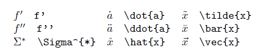

Markdown

## LATEX 문법

[LATEX document](https://drive.google.com/file/d/1dEEAXMhHo9TgmZmXSNWSVlG6YOeWp_gj/view)

내가 자주볼것같아서 정리한 LATEX 문법

#### 00. 사용법

- 본문 ->  수식블록 click
- 단축키 `Ctrl` + `Shift` + `M`

#### 01. Common construct

<table>
    <tr>
        <th style="text-align:center;"
            bgcolor="#F5F5F5">result</th>
        <th style="text-align:center;"
            bgcolor="#F5F5F5">input</th>
    </tr>
    <tr>
        <td style="text-align:center;"
            bgcolor="#FFFFFF">
            </td>
        <td bgcolor="#FFFFFF"
            style="text-align:center;">x^2</td>
    </tr>
    <tr>
        <td style="text-align:center;"
            bgcolor="#FFFFFF">
            </td>
        <td bgcolor="#FFFFFF"
            style="text-align:center;">x_{i,j}</td>
    </tr>
    <tr>
        <td style="text-align:center;"
            bgcolor="#FFFFFF">
            </td>
        <td bgcolor="#FFFFFF"
            style="text-align:center;">\sqrt{2}, \sqrt[n]{3}</td>
    </tr>
    <tr>
        <td style="text-align:center;"
            bgcolor="#FFFFFF">
            </td>
        <td bgcolor="#FFFFFF"
            style="text-align:center;">\frac{2}{3}, 2/3</td>
    </tr>
</table>

#### 02. Calligraphic letters

<table>
    <tr>
        <th style="text-align:center;"
            bgcolor="#F5F5F5">result</th>
        <th style="text-align:center;"
            bgcolor="#F5F5F5">input</th>
    </tr>
    <tr>
        <td style="text-align:center;"
            bgcolor="#FFFFFF">
            </td>
        <td style="text-align:center;"
            bgcolor="#FFFFFF">\mathcal{A}</td>
    </tr>
</table>

$$
\mathcal{A B C D E F G H I J K L M N O P Q R S T U V W X Y Z}
$$

$$
\mathscr{A B C D E F G H I J K L M N O P Q R S T U V W X Y N Z}
$$

#### 03. Greek

#### 04. Sets and logic

<table>
    <tr>
        <th style="text-align:center;"
            bgcolor="#F5F5F5">result</th>
        <th style="text-align:center;"
            bgcolor="#F5F5F5">input</th>
    </tr>
    <tr>
        <td style="text-align:center;"
            bgcolor="#FFFFFF">
            </td>
        <td bgcolor="#FFFFFF"
            style="text-align:center;">\not\subset</td>
    </tr>
    <tr>
        <td style="text-align:center;"
            bgcolor="#FFFFFF">
            </td>
        <td bgcolor="#FFFFFF"
            style="text-align:center;">A^{\mathsf{c}}</td>
    </tr>
    <tr>
        <td style="text-align:center;"
            bgcolor="#FFFFFF">
            </td>
        <td bgcolor="#FFFFFF"
            style="text-align:center;">A^{\complement}</td>
    </tr>
    <tr>
        <td style="text-align:center;"
            bgcolor="#FFFFFF">
            </td>
        <td bgcolor="#FFFFFF"
            style="text-align:center;">\overline{A}</td>
    </tr>
</table>

#### 05. Decorations

$$
\imath\\\jmath\\\vec{\imath}\\\boldsymbol{x}
$$

#### 06. Dots

#### 07. Roman names

#### 08. Other symbols

#### 09. Arrows

#### 10. Variable-sized operators

#### 11. Fences

#### 12. Arrays, Matrics

#### 13. Spacing in mathematics

#### 14. Displayed equations