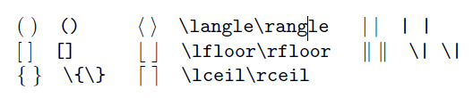

Markdown

## LATEX 문법

[LATEX document](https://drive.google.com/file/d/1dEEAXMhHo9TgmZmXSNWSVlG6YOeWp_gj/view)

[기호검색 사이트 - detexify](https://detexify.kirelabs.org/classify.html)

내가 자주볼것같아서 정리한 LATEX 문법

#### 00. 사용법

- 본문 ->  수식블록 click
- 단축키 `Ctrl` + `Shift` + `M`

#### 01. Common construct

<table>
    <tr>
        <th style="text-align:center;"
            bgcolor="#F5F5F5">result</th>
        <th style="text-align:center;"
            bgcolor="#F5F5F5">input</th>
    </tr>
    <tr>
        <td style="text-align:center;"
            bgcolor="#FFFFFF">
            </td>
        <td bgcolor="#FFFFFF"
            style="text-align:center;">x^2</td>
    </tr>
    <tr>
        <td style="text-align:center;"
            bgcolor="#FFFFFF">
            </td>
        <td bgcolor="#FFFFFF"
            style="text-align:center;">x_{i,j}</td>
    </tr>
    <tr>
        <td style="text-align:center;"
            bgcolor="#FFFFFF">
            </td>
        <td bgcolor="#FFFFFF"
            style="text-align:center;">\sqrt{2}, \sqrt[n]{3}</td>
    </tr>
    <tr>
        <td style="text-align:center;"
            bgcolor="#FFFFFF">
            </td>
        <td bgcolor="#FFFFFF"
            style="text-align:center;">\frac{2}{3}, 2/3</td>
    </tr>
</table>

#### 02. Calligraphic letters

<table>
    <tr>
        <th style="text-align:center;"
            bgcolor="#F5F5F5">result</th>
        <th style="text-align:center;"
            bgcolor="#F5F5F5">input</th>
    </tr>
    <tr>
        <td style="text-align:center;"
            bgcolor="#FFFFFF">
            </td>
        <td style="text-align:center;"
            bgcolor="#FFFFFF">\mathcal{A}</td>
    </tr>
    <tr>
        <td style="text-align:center;"
            bgcolor="#FFFFFF">
            </td>
        <td style="text-align:center;"
            bgcolor="#FFFFFF">\mathscr{A}</td>
    </tr>
</table>

$$
\mathcal{A B C D E F G H I J K L M N O P Q R S T U V W X Y Z}
$$

$$
\mathscr{A B C D E F G H I J K L M N O P Q R S T U V W X Y N Z}
$$

#### 03. Greek

#### 04. Sets and logic

<table>
    <tr>
        <th style="text-align:center;"
            bgcolor="#F5F5F5">result</th>
        <th style="text-align:center;"
            bgcolor="#F5F5F5">input</th>
    </tr>
    <tr>
        <td style="text-align:center;"
            bgcolor="#FFFFFF">
            </td>
        <td bgcolor="#FFFFFF"
            style="text-align:center;">\not\subset</td>
    </tr>
    <tr>
        <td style="text-align:center;"
            bgcolor="#FFFFFF">
            </td>
        <td bgcolor="#FFFFFF"
            style="text-align:center;">A^{\mathsf{c}}</td>
    </tr>
    <tr>
        <td style="text-align:center;"
            bgcolor="#FFFFFF">
            </td>
        <td bgcolor="#FFFFFF"
            style="text-align:center;">A^{\complement}</td>
    </tr>
    <tr>
        <td style="text-align:center;"
            bgcolor="#FFFFFF">
            </td>
        <td bgcolor="#FFFFFF"
            style="text-align:center;">\overline{A}</td>
    </tr>
</table>

#### 05. Decorations

$$
\imath\\
\jmath\\
\vec{\imath}\\
\boldsymbol{x}\\
\\
\overline{x+y}\\
\widehat{x+y}\\
\overbrace{..}\\
\underbrace{x+y}_{|A|}
$$

#### 06. Dots

$$
\{0,1,2,\,\ldots\}\\
\text{London}, \text{Paris}, \ldots{}\ ,
1+\cdots+100\\
\vdots\\
\ddots
$$

#### 07. Roman names

$$
\tan(x)
$$

#### 08. Other symbols

$$
\{a\in S\mid\text{$a$ is odd}\}.
$$

#### 09. Arrows

$$
\nleftarrow
$$

#### 10. Variable-sized operators

$$
\sum_{j=0}^3 j^2\\
\int_{x=0}^3 x^2\,dx \\
$$

#### 11. Fences

$$
\Big[\sum_{k=0}^n e^{k^2}\Big] \\
\\
\big[
\Big[
\bigg[
\Bigg[
\\\\
\left\langle i,2^{2^i}\right\rangle
\\\\
\left.\frac{df}{dx}\right|_{x_0}
$$

#### 12. Arrays, Matrics

$$
\begin {array}{rcl}
0 &\leftrightarrow &0 \\
1 &\leftrightarrow &1 \\
2 &\leftrightarrow &4 \\
\vdots & &\vdots
\end {array}
$$

$$
f_n =
\begin{cases}
a &\text {if $n =0$} \\
r\cdot f_{n -1} &\text {else}
\end{cases}
$$

$$
\begin{pmatrix}
a&b \\
c&d
\end{pmatrix}
$$

#### 13. Spacing in mathematics

$$
\sqrt{2}\,x
\\
n/log n
\\
n/\!\log n
\\
\rightarrow\quad\leftarrow
\\
\rightarrow\qquad\leftarrow
$$

#### 14. Displayed equations

$$
\begin {equation*}
S=k\cdot \lg W
\end {equation*}
$$

$$
\begin{multline*}
\sin (x)=x -\frac{x ^3}{3!} \\
	+\frac {x^5}{5!} -\cdots
\end{multline*}
$$

$$
\begin {align*}
\nabla \cdot \boldsymbol {D} &= \rho \\
\nabla \cdot \boldsymbol {B} &= 0
\end {align*}
$$

#### 15. Discrete mathematics examples

$$
\dbinom{n}{k} \binom{n}{k} \tbinom{n}{k}
\\
n^{\underline{r}}
\\
{}_nP_r
$$

#### 16. Statistics examples

$$
\sigma^2=\sqrt{\,\sum (x_i-\mu)^2/N}
\\\\
E(X)=\mu_X=\sum (x_i-P(x_i))
\\\\
\frac {1}{ sqrt {2\sigma ^2\pi }}
\,e^{ -\frac {(x -\mu )^2}{2\sigma ^2}}
\\\\
$$

